# SEQUENCE DIAGRAMS - HỆ THỐNG RENTAL HOME

**Dự án:** Rental Home - Multi-Process Rental Platform  
**Ngày:** December 30, 2025  
**Phiên bản:** 2.0 (Updated)

---

## DANH MỤC SEQUENCE DIAGRAMS

### 1. Authentication & User Management (SD01 - SD05)
- SD01: Đăng ký
- SD02: Đăng nhập
- SD03: Quên mật khẩu
- SD04: Đặt lại mật khẩu
- SD05: Đăng xuất

### 2. Identity Verification (SD06 - SD08)
- SD06: Xác thực danh tính (User)
- SD07: Quản lý xác thực danh tính (Admin)
- SD08: Cập nhật xác thực danh tính

### 3. PROCESS 1 - Entire Place Rental (SD10 - SD22)
- SD10: Tạo listing Entire Place
- SD11: Chỉnh sửa listing
- SD12: Ẩn/Hiện listing
- SD13: Tìm kiếm Entire Place
- SD14: Xem chi tiết Entire Place
- SD15: Đặt phòng với BookingIntent
- SD16: Thanh toán VNPay (Full/Deposit)
- SD17: Thanh toán Cash
- SD18: Host chấp nhận/từ chối booking
- SD19: Guest check-in
- SD20: Guest check-out
- SD21: Hủy đặt phòng
- SD22: Xem lịch sử booking

### 4. PROCESS 2 - Room Rental (SD30 - SD42)
- SD30: Tạo listing Room
- SD31: Tìm kiếm Room
- SD32: Xem chi tiết Room
- SD33: Gửi yêu cầu thuê phòng
- SD34: Host xem yêu cầu thuê
- SD35: Host chấp nhận/từ chối yêu cầu
- SD36: Tạo Agreement
- SD37: Tenant ký Agreement
- SD38: Host ký Agreement
- SD39: Quản lý thanh toán hàng tháng
- SD40: Move-in xác nhận
- SD41: Kết thúc thuê phòng
- SD42: Xem danh sách thuê

### 5. PROCESS 3 - Roommate Matching (SD50 - SD60)
- SD50: Tạo bài đăng tìm bạn cùng phòng
- SD51: Tìm kiếm bài đăng Roommate
- SD52: Xem chi tiết bài đăng
- SD53: Gửi yêu cầu kết nối
- SD54: Chấp nhận/Từ chối yêu cầu
- SD55: Tạo Match
- SD56: Chat với roommate
- SD57: Chỉnh sửa bài đăng
- SD58: Đóng bài đăng
- SD59: Xem yêu cầu đã gửi
- SD60: Xem yêu cầu nhận được

### 6. Messaging & Communication (SD70 - SD73)
- SD70: Gửi tin nhắn
- SD71: Xem danh sách hội thoại
- SD72: Xem lịch sử tin nhắn
- SD73: Liên hệ Host

### 7. Reviews & Wishlist (SD80 - SD83)
- SD80: Viết đánh giá
- SD81: Xem đánh giá
- SD82: Thêm vào Wishlist
- SD83: Xóa khỏi Wishlist

### 8. Admin Management (SD90 - SD95)
- SD90: Xem Admin Dashboard
- SD91: Quản lý Users
- SD92: Quản lý Listings
- SD93: Quản lý Identity Verification
- SD94: Quản lý Categories
- SD95: Quản lý Facilities

---

## 1. AUTHENTICATION & USER MANAGEMENT

### SD01: Đăng ký (UC01)

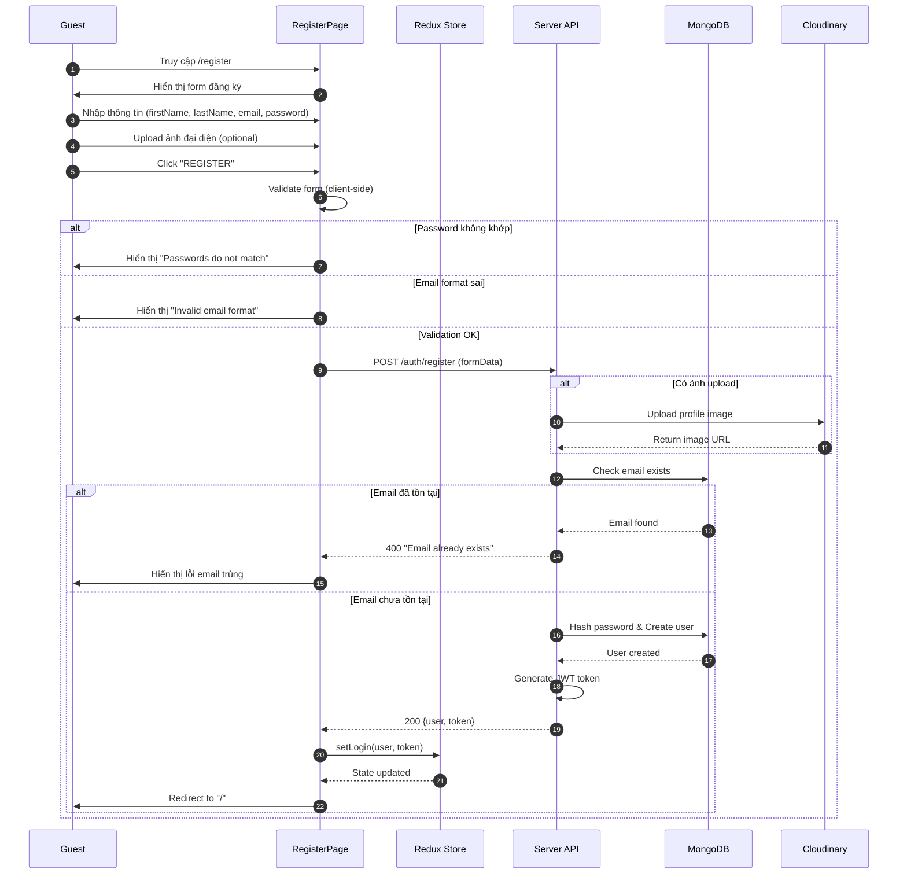
```mermaid
sequenceDiagram
    autonumber
    participant G as Guest
    participant UI as RegisterPage
    participant Redux as Redux Store
    participant API as Server API
    participant DB as MongoDB
    participant Cloud as Cloudinary

    G->>UI: Truy cập /register
    UI->>G: Hiển thị form đăng ký
    G->>UI: Nhập thông tin (firstName, lastName, email, password)
    G->>UI: Upload ảnh đại diện (optional)
    G->>UI: Click "REGISTER"
    
    UI->>UI: Validate form (client-side)
    alt Password không khớp
        UI->>G: Hiển thị "Passwords do not match"
    else Email format sai
        UI->>G: Hiển thị "Invalid email format"
    else Validation OK
        UI->>API: POST /auth/register (formData)
        
        alt Có ảnh upload
            API->>Cloud: Upload profile image
            Cloud-->>API: Return image URL
        end
        
        API->>DB: Check email exists
        alt Email đã tồn tại
            DB-->>API: Email found
            API-->>UI: 400 "Email already exists"
            UI->>G: Hiển thị lỗi email trùng
        else Email chưa tồn tại
            API->>DB: Hash password & Create user
            DB-->>API: User created
            API->>API: Generate JWT token
            API-->>UI: 200 {user, token}
            UI->>Redux: setLogin(user, token)
            Redux-->>UI: State updated
            UI->>G: Redirect to "/"
        end
    end
```

---

### SD02: Đăng nhập (UC02)

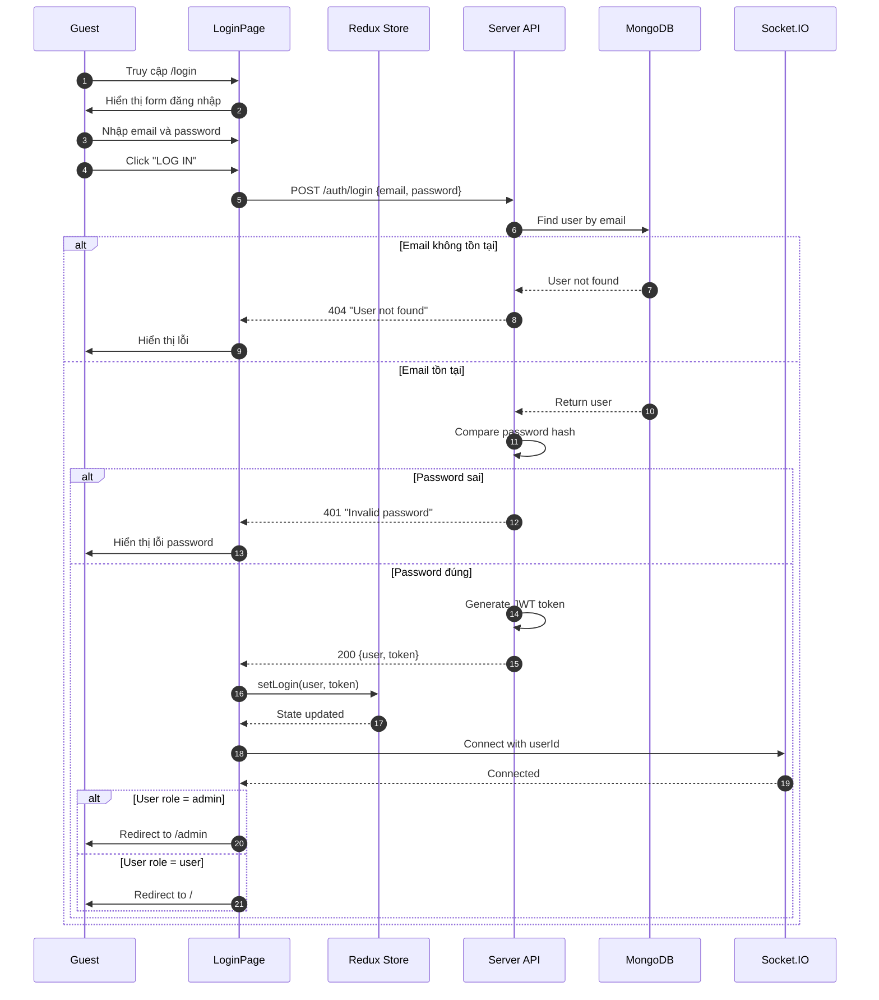
```mermaid
sequenceDiagram
    autonumber
    participant G as Guest
    participant UI as LoginPage
    participant Redux as Redux Store
    participant API as Server API
    participant DB as MongoDB
    participant Socket as Socket.IO

    G->>UI: Truy cập /login
    UI->>G: Hiển thị form đăng nhập
    G->>UI: Nhập email và password
    G->>UI: Click "LOG IN"
    
    UI->>API: POST /auth/login {email, password}
    API->>DB: Find user by email
    
    alt Email không tồn tại
        DB-->>API: User not found
        API-->>UI: 404 "User not found"
        UI->>G: Hiển thị lỗi
    else Email tồn tại
        DB-->>API: Return user
        API->>API: Compare password hash
        
        alt Password sai
            API-->>UI: 401 "Invalid password"
            UI->>G: Hiển thị lỗi password
        else Password đúng
            API->>API: Generate JWT token
            API-->>UI: 200 {user, token}
            UI->>Redux: setLogin(user, token)
            Redux-->>UI: State updated
            UI->>Socket: Connect with userId
            Socket-->>UI: Connected
            
            alt User role = admin
                UI->>G: Redirect to /admin
            else User role = user
                UI->>G: Redirect to /
            end
        end
    end
```

---

### SD03: Quên mật khẩu (UC03)

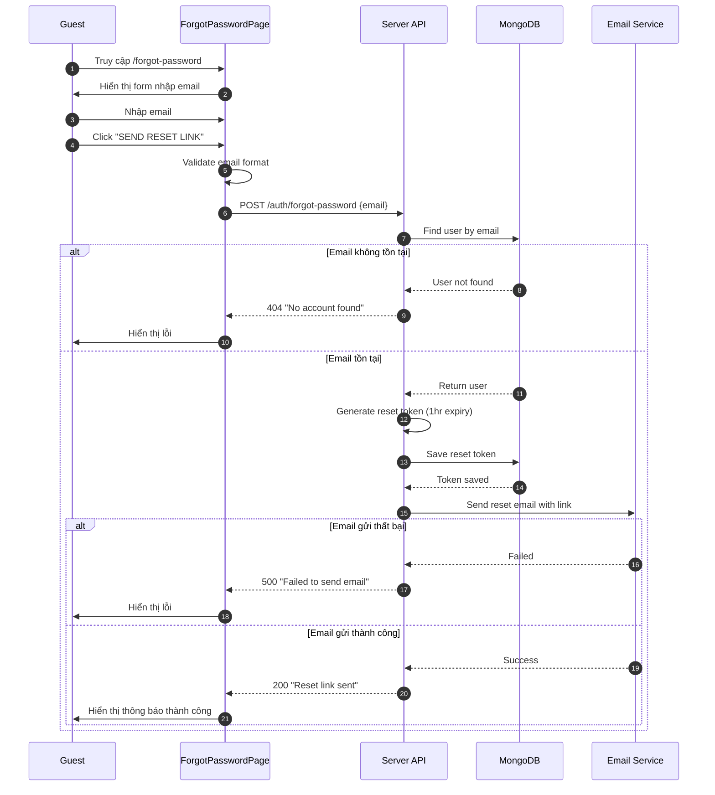
```mermaid
sequenceDiagram
    autonumber
    participant G as Guest
    participant UI as ForgotPasswordPage
    participant API as Server API
    participant DB as MongoDB
    participant Email as Email Service

    G->>UI: Truy cập /forgot-password
    UI->>G: Hiển thị form nhập email
    G->>UI: Nhập email
    G->>UI: Click "SEND RESET LINK"
    
    UI->>UI: Validate email format
    UI->>API: POST /auth/forgot-password {email}
    
    API->>DB: Find user by email
    alt Email không tồn tại
        DB-->>API: User not found
        API-->>UI: 404 "No account found"
        UI->>G: Hiển thị lỗi
    else Email tồn tại
        DB-->>API: Return user
        API->>API: Generate reset token (1hr expiry)
        API->>DB: Save reset token
        DB-->>API: Token saved
        API->>Email: Send reset email with link
        
        alt Email gửi thất bại
            Email-->>API: Failed
            API-->>UI: 500 "Failed to send email"
            UI->>G: Hiển thị lỗi
        else Email gửi thành công
            Email-->>API: Success
            API-->>UI: 200 "Reset link sent"
            UI->>G: Hiển thị thông báo thành công
        end
    end
```

---

### SD04: Đặt lại mật khẩu (UC04)

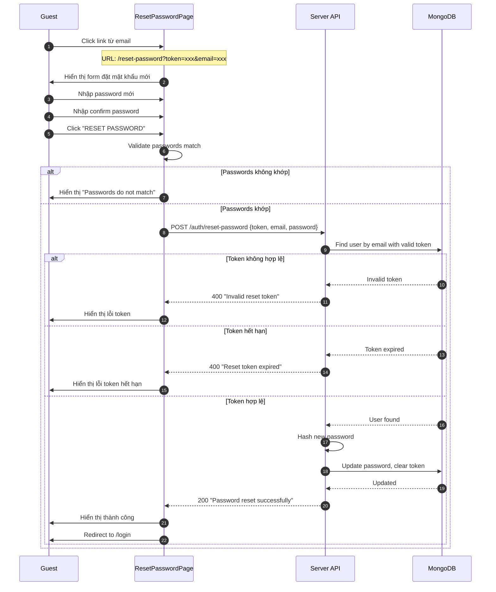
```mermaid
sequenceDiagram
    autonumber
    participant G as Guest
    participant UI as ResetPasswordPage
    participant API as Server API
    participant DB as MongoDB

    G->>UI: Click link từ email
    Note over UI: URL: /reset-password?token=xxx&email=xxx
    UI->>G: Hiển thị form đặt mật khẩu mới
    G->>UI: Nhập password mới
    G->>UI: Nhập confirm password
    G->>UI: Click "RESET PASSWORD"
    
    UI->>UI: Validate passwords match
    alt Passwords không khớp
        UI->>G: Hiển thị "Passwords do not match"
    else Passwords khớp
        UI->>API: POST /auth/reset-password {token, email, password}
        
        API->>DB: Find user by email with valid token
        alt Token không hợp lệ
            DB-->>API: Invalid token
            API-->>UI: 400 "Invalid reset token"
            UI->>G: Hiển thị lỗi token
        else Token hết hạn
            DB-->>API: Token expired
            API-->>UI: 400 "Reset token expired"
            UI->>G: Hiển thị lỗi token hết hạn
        else Token hợp lệ
            DB-->>API: User found
            API->>API: Hash new password
            API->>DB: Update password, clear token
            DB-->>API: Updated
            API-->>UI: 200 "Password reset successfully"
            UI->>G: Hiển thị thành công
            UI->>G: Redirect to /login
        end
    end
```

---

### SD05: Đăng xuất (UC05)

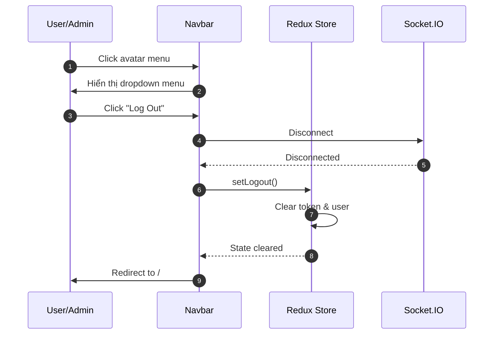
```mermaid
sequenceDiagram
    autonumber
    participant U as User/Admin
    participant UI as Navbar
    participant Redux as Redux Store
    participant Socket as Socket.IO

    U->>UI: Click avatar menu
    UI->>U: Hiển thị dropdown menu
    U->>UI: Click "Log Out"
    
    UI->>Socket: Disconnect
    Socket-->>UI: Disconnected
    UI->>Redux: setLogout()
    Redux->>Redux: Clear token & user
    Redux-->>UI: State cleared
    UI->>U: Redirect to /
```

---

## 2. IDENTITY VERIFICATION

### SD06: Xác thực danh tính - User (UC06)

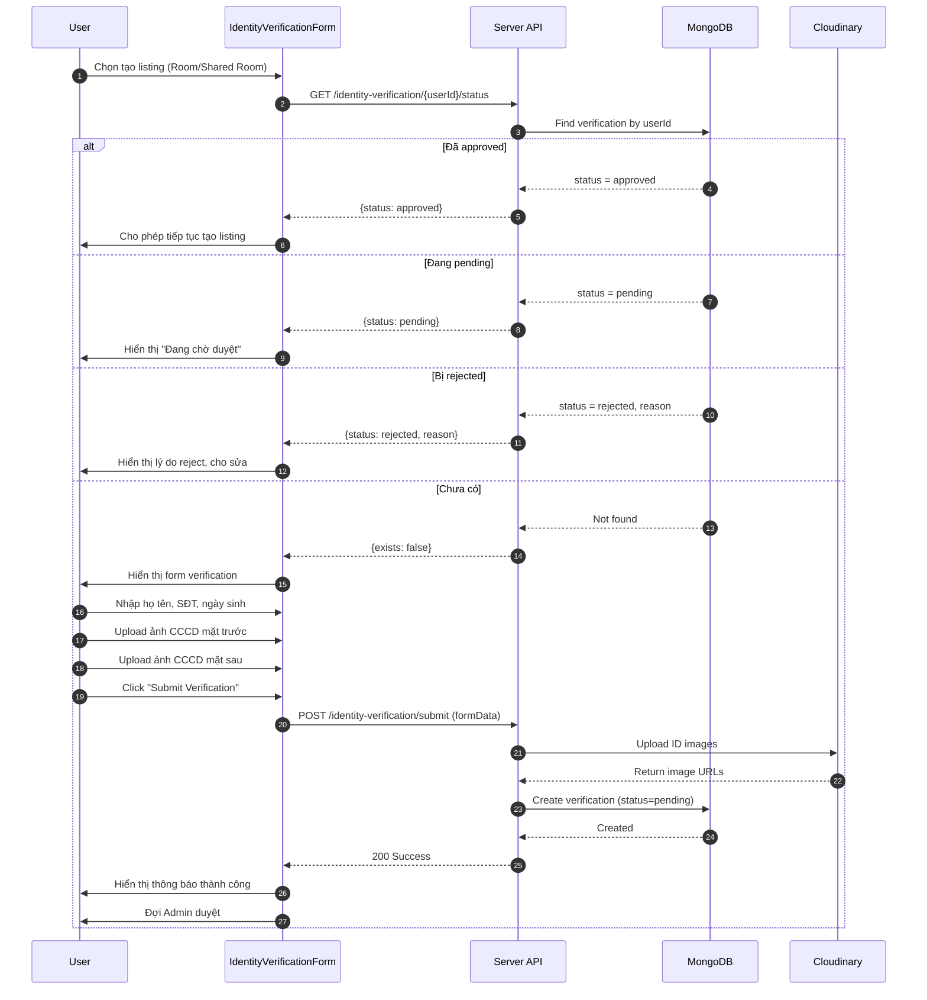
```mermaid
sequenceDiagram
    autonumber
    participant U as User
    participant UI as IdentityVerificationForm
    participant API as Server API
    participant DB as MongoDB
    participant Cloud as Cloudinary

    U->>UI: Chọn tạo listing (Room/Shared Room)
    UI->>API: GET /identity-verification/{userId}/status
    API->>DB: Find verification by userId
    
    alt Đã approved
        DB-->>API: status = approved
        API-->>UI: {status: approved}
        UI->>U: Cho phép tiếp tục tạo listing
    else Đang pending
        DB-->>API: status = pending
        API-->>UI: {status: pending}
        UI->>U: Hiển thị "Đang chờ duyệt"
    else Bị rejected
        DB-->>API: status = rejected, reason
        API-->>UI: {status: rejected, reason}
        UI->>U: Hiển thị lý do reject, cho sửa
    else Chưa có
        DB-->>API: Not found
        API-->>UI: {exists: false}
        UI->>U: Hiển thị form verification
        
        U->>UI: Nhập họ tên, SĐT, ngày sinh
        U->>UI: Upload ảnh CCCD mặt trước
        U->>UI: Upload ảnh CCCD mặt sau
        U->>UI: Click "Submit Verification"
        
        UI->>API: POST /identity-verification/submit (formData)
        API->>Cloud: Upload ID images
        Cloud-->>API: Return image URLs
        API->>DB: Create verification (status=pending)
        DB-->>API: Created
        API-->>UI: 200 Success
        UI->>U: Hiển thị thông báo thành công
        UI->>U: Đợi Admin duyệt
    end
```

---

### SD07: Quản lý xác thực danh tính - Admin (UC07)

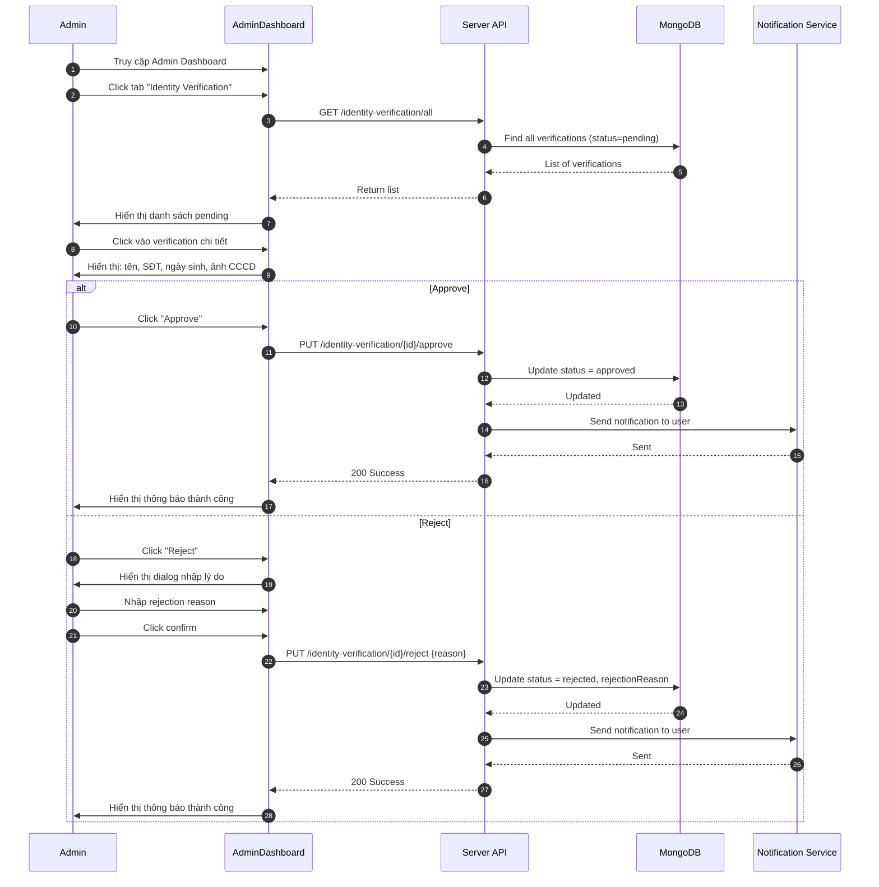
```mermaid
sequenceDiagram
    autonumber
    participant A as Admin
    participant UI as AdminDashboard
    participant API as Server API
    participant DB as MongoDB
    participant Notif as Notification Service

    A->>UI: Truy cập Admin Dashboard
    A->>UI: Click tab "Identity Verification"
    UI->>API: GET /identity-verification/all
    API->>DB: Find all verifications (status=pending)
    DB-->>API: List of verifications
    API-->>UI: Return list
    UI->>A: Hiển thị danh sách pending
    
    A->>UI: Click vào verification chi tiết
    UI->>A: Hiển thị: tên, SĐT, ngày sinh, ảnh CCCD
    
    alt Approve
        A->>UI: Click "Approve"
        UI->>API: PUT /identity-verification/{id}/approve
        API->>DB: Update status = approved
        DB-->>API: Updated
        API->>Notif: Send notification to user
        Notif-->>API: Sent
        API-->>UI: 200 Success
        UI->>A: Hiển thị thông báo thành công
    else Reject
        A->>UI: Click "Reject"
        UI->>A: Hiển thị dialog nhập lý do
        A->>UI: Nhập rejection reason
        A->>UI: Click confirm
        UI->>API: PUT /identity-verification/{id}/reject {reason}
        API->>DB: Update status = rejected, rejectionReason
        DB-->>API: Updated
        API->>Notif: Send notification to user
        Notif-->>API: Sent
        API-->>UI: 200 Success
        UI->>A: Hiển thị thông báo thành công
    end
```

---

### SD08: Cập nhật xác thực danh tính (UC08)

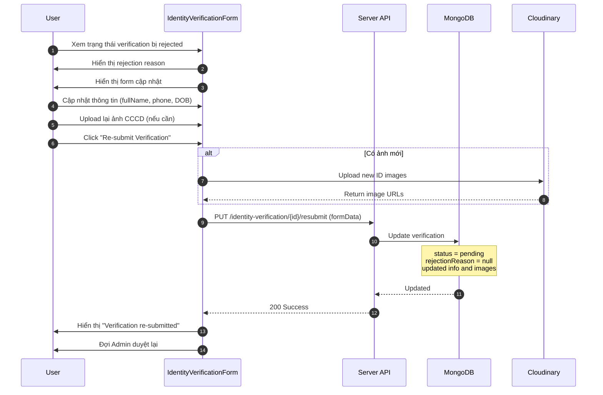
```mermaid
sequenceDiagram
    autonumber
    participant U as User
    participant UI as IdentityVerificationForm
    participant API as Server API
    participant DB as MongoDB
    participant Cloud as Cloudinary

    U->>UI: Xem trạng thái verification bị rejected
    UI->>U: Hiển thị rejection reason
    UI->>U: Hiển thị form cập nhật
    
    U->>UI: Cập nhật thông tin (fullName, phone, DOB)
    U->>UI: Upload lại ảnh CCCD (nếu cần)
    U->>UI: Click "Re-submit Verification"
    
    alt Có ảnh mới
        UI->>Cloud: Upload new ID images
        Cloud-->>UI: Return image URLs
    end
    
    UI->>API: PUT /identity-verification/{id}/resubmit (formData)
    API->>DB: Update verification
    Note over DB: status = pending<br/>rejectionReason = null<br/>updated info and images
    DB-->>API: Updated
    API-->>UI: 200 Success
    UI->>U: Hiển thị "Verification re-submitted"
    UI->>U: Đợi Admin duyệt lại
```

---

## 3. PROCESS 1 - ENTIRE PLACE RENTAL

### SD10: Tạo listing Entire Place (UC10)

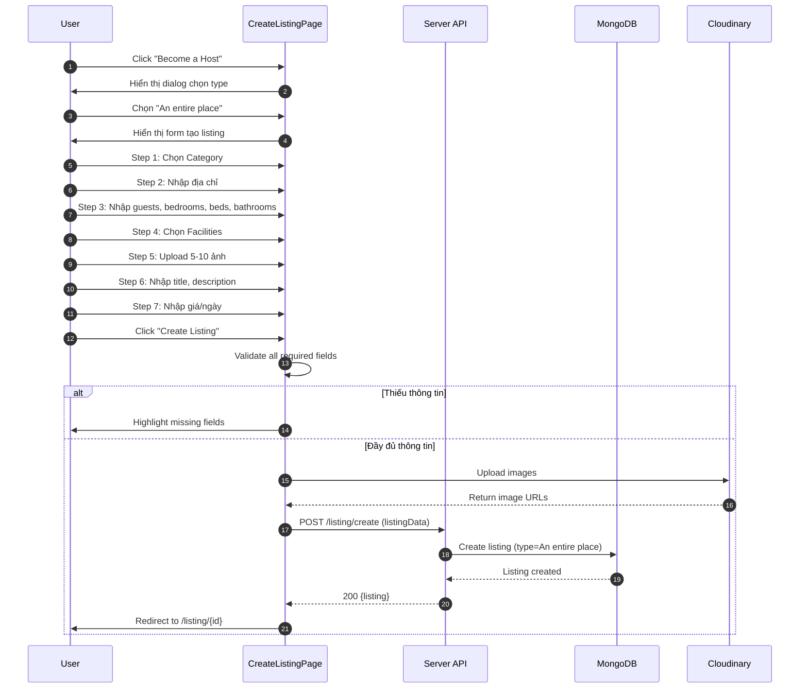
```mermaid
sequenceDiagram
    autonumber
    participant U as User
    participant UI as CreateListingPage
    participant API as Server API
    participant DB as MongoDB
    participant Cloud as Cloudinary

    U->>UI: Click "Become a Host"
    UI->>U: Hiển thị dialog chọn type
    U->>UI: Chọn "An entire place"
    UI->>U: Hiển thị form tạo listing
    
    U->>UI: Step 1: Chọn Category
    U->>UI: Step 2: Nhập địa chỉ
    U->>UI: Step 3: Nhập guests, bedrooms, beds, bathrooms
    U->>UI: Step 4: Chọn Facilities
    U->>UI: Step 5: Upload 5-10 ảnh
    U->>UI: Step 6: Nhập title, description
    U->>UI: Step 7: Nhập giá/ngày
    U->>UI: Click "Create Listing"
    
    UI->>UI: Validate all required fields
    alt Thiếu thông tin
        UI->>U: Highlight missing fields
    else Đầy đủ thông tin
        UI->>Cloud: Upload images
        Cloud-->>UI: Return image URLs
        
        UI->>API: POST /listing/create (listingData)
        API->>DB: Create listing (type=An entire place)
        DB-->>API: Listing created
        API-->>UI: 200 {listing}
        UI->>U: Redirect to /listing/{id}
    end
```

---

---

### SD11: Chỉnh sửa listing (UC11)

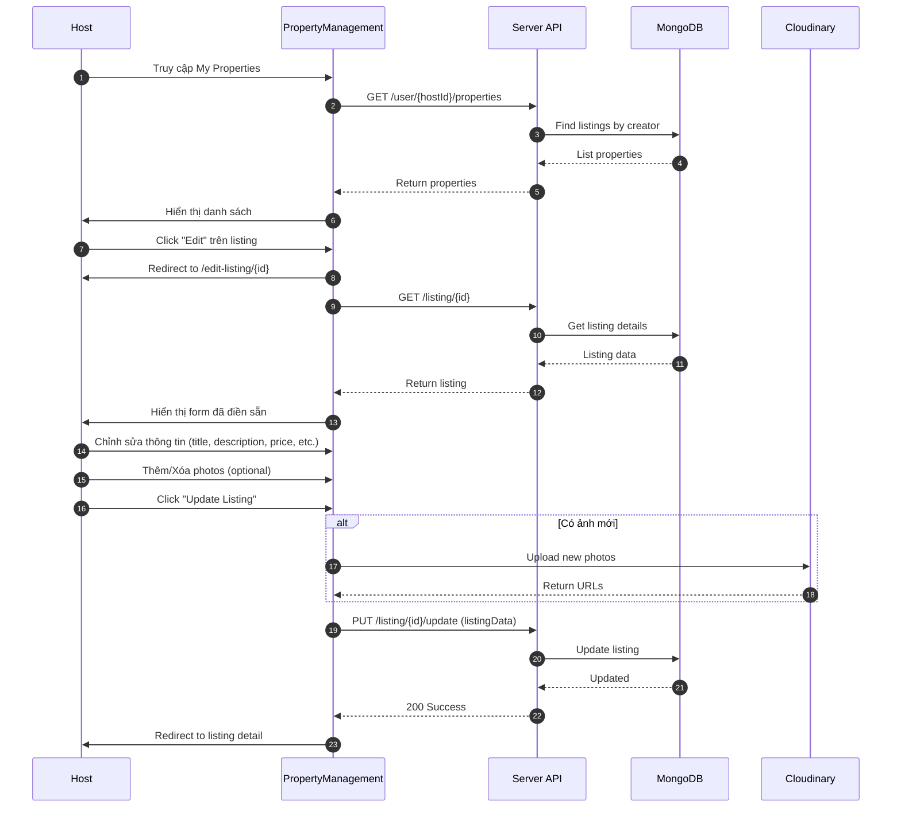
```mermaid
sequenceDiagram
    autonumber
    participant H as Host
    participant UI as PropertyManagement
    participant API as Server API
    participant DB as MongoDB
    participant Cloud as Cloudinary

    H->>UI: Truy cập My Properties
    UI->>API: GET /user/{hostId}/properties
    API->>DB: Find listings by creator
    DB-->>API: List properties
    API-->>UI: Return properties
    UI->>H: Hiển thị danh sách
    
    H->>UI: Click "Edit" trên listing
    UI->>H: Redirect to /edit-listing/{id}
    UI->>API: GET /listing/{id}
    API->>DB: Get listing details
    DB-->>API: Listing data
    API-->>UI: Return listing
    UI->>H: Hiển thị form đã điền sẵn
    
    H->>UI: Chỉnh sửa thông tin (title, description, price, etc.)
    H->>UI: Thêm/Xóa photos (optional)
    H->>UI: Click "Update Listing"
    
    alt Có ảnh mới
        UI->>Cloud: Upload new photos
        Cloud-->>UI: Return URLs
    end
    
    UI->>API: PUT /listing/{id}/update (listingData)
    API->>DB: Update listing
    DB-->>API: Updated
    API-->>UI: 200 Success
    UI->>H: Redirect to listing detail
```

---

### SD12: Ẩn/Hiện listing (UC12)

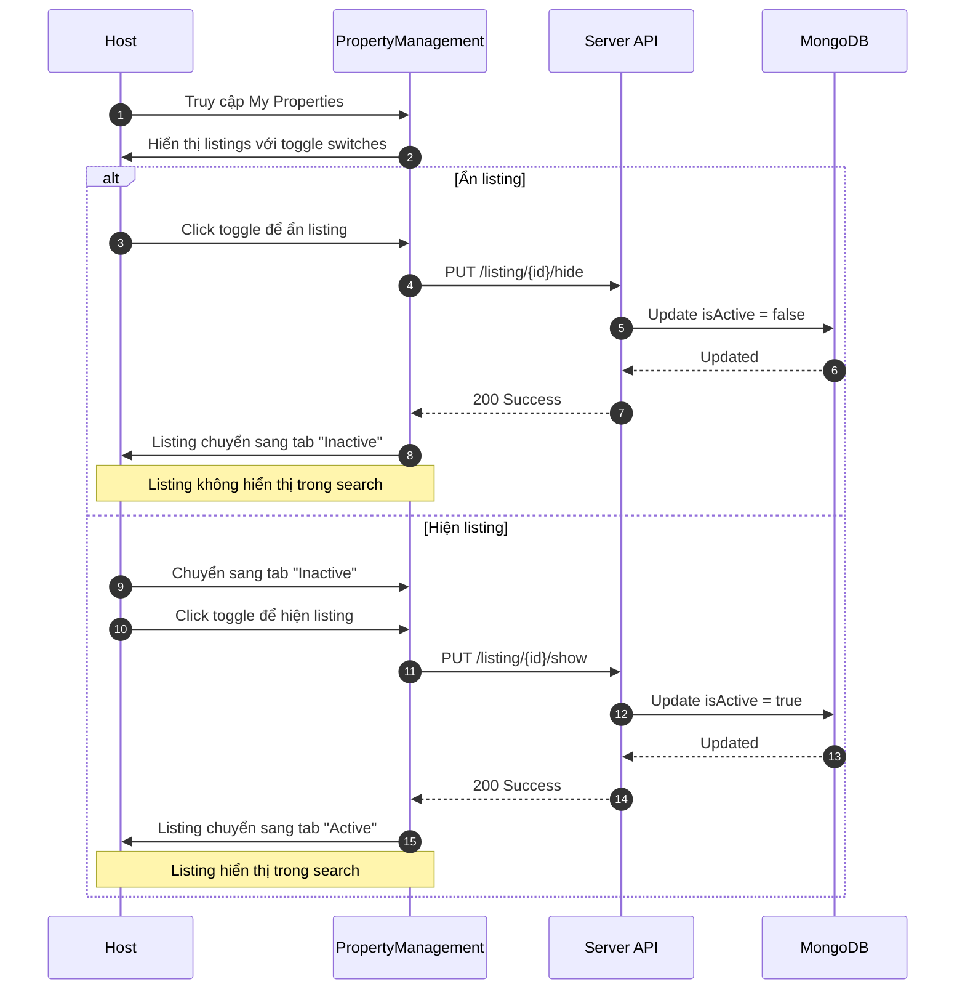
```mermaid
sequenceDiagram
    autonumber
    participant H as Host
    participant UI as PropertyManagement
    participant API as Server API
    participant DB as MongoDB

    H->>UI: Truy cập My Properties
    UI->>H: Hiển thị listings với toggle switches
    
    alt Ẩn listing
        H->>UI: Click toggle để ẩn listing
        UI->>API: PUT /listing/{id}/hide
        API->>DB: Update isActive = false
        DB-->>API: Updated
        API-->>UI: 200 Success
        UI->>H: Listing chuyển sang tab "Inactive"
        Note over H,UI: Listing không hiển thị trong search
    else Hiện listing
        H->>UI: Chuyển sang tab "Inactive"
        H->>UI: Click toggle để hiện listing
        UI->>API: PUT /listing/{id}/show
        API->>DB: Update isActive = true
        DB-->>API: Updated
        API-->>UI: 200 Success
        UI->>H: Listing chuyển sang tab "Active"
        Note over H,UI: Listing hiển thị trong search
    end
```

---

### SD13: Tìm kiếm Entire Place (UC13)

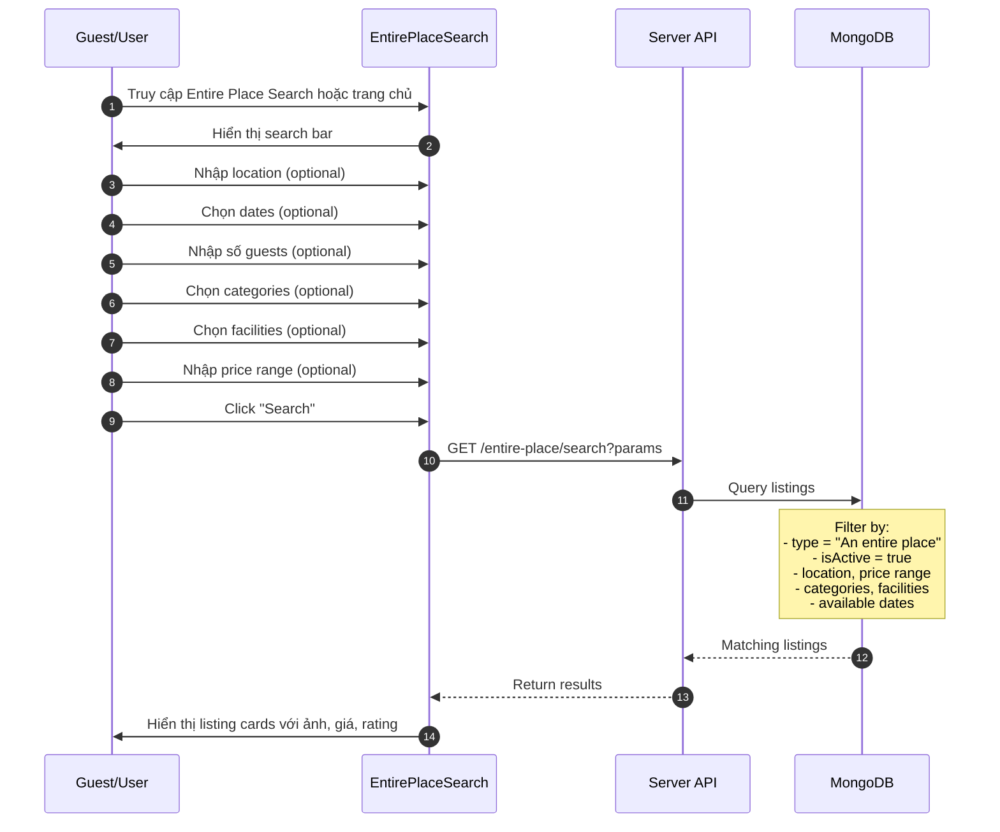
```mermaid
sequenceDiagram
    autonumber
    participant G as Guest/User
    participant UI as EntirePlaceSearch
    participant API as Server API
    participant DB as MongoDB

    G->>UI: Truy cập Entire Place Search hoặc trang chủ
    UI->>G: Hiển thị search bar
    
    G->>UI: Nhập location (optional)
    G->>UI: Chọn dates (optional)
    G->>UI: Nhập số guests (optional)
    G->>UI: Chọn categories (optional)
    G->>UI: Chọn facilities (optional)
    G->>UI: Nhập price range (optional)
    G->>UI: Click "Search"
    
    UI->>API: GET /entire-place/search?params
    API->>DB: Query listings
    Note over DB: Filter by:<br/>- type = "An entire place"<br/>- isActive = true<br/>- location, price range<br/>- categories, facilities<br/>- available dates
    DB-->>API: Matching listings
    API-->>UI: Return results
    UI->>G: Hiển thị listing cards với ảnh, giá, rating
```

---

### SD14: Xem chi tiết Entire Place (UC14)

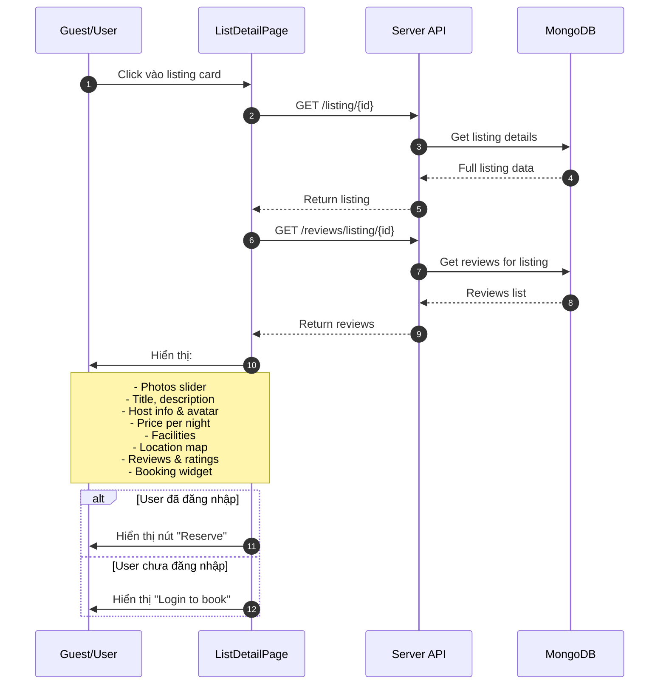
```mermaid
sequenceDiagram
    autonumber
    participant G as Guest/User
    participant UI as ListDetailPage
    participant API as Server API
    participant DB as MongoDB

    G->>UI: Click vào listing card
    UI->>API: GET /listing/{id}
    API->>DB: Get listing details
    DB-->>API: Full listing data
    API-->>UI: Return listing
    
    UI->>API: GET /reviews/listing/{id}
    API->>DB: Get reviews for listing
    DB-->>API: Reviews list
    API-->>UI: Return reviews
    
    UI->>G: Hiển thị:
    Note over G,UI: - Photos slider<br/>- Title, description<br/>- Host info & avatar<br/>- Price per night<br/>- Facilities<br/>- Location map<br/>- Reviews & ratings<br/>- Booking widget
    
    alt User đã đăng nhập
        UI->>G: Hiển thị nút "Reserve"
    else User chưa đăng nhập
        UI->>G: Hiển thị "Login to book"
    end
```

---

### SD15: Đặt phòng với BookingIntent (UC15)

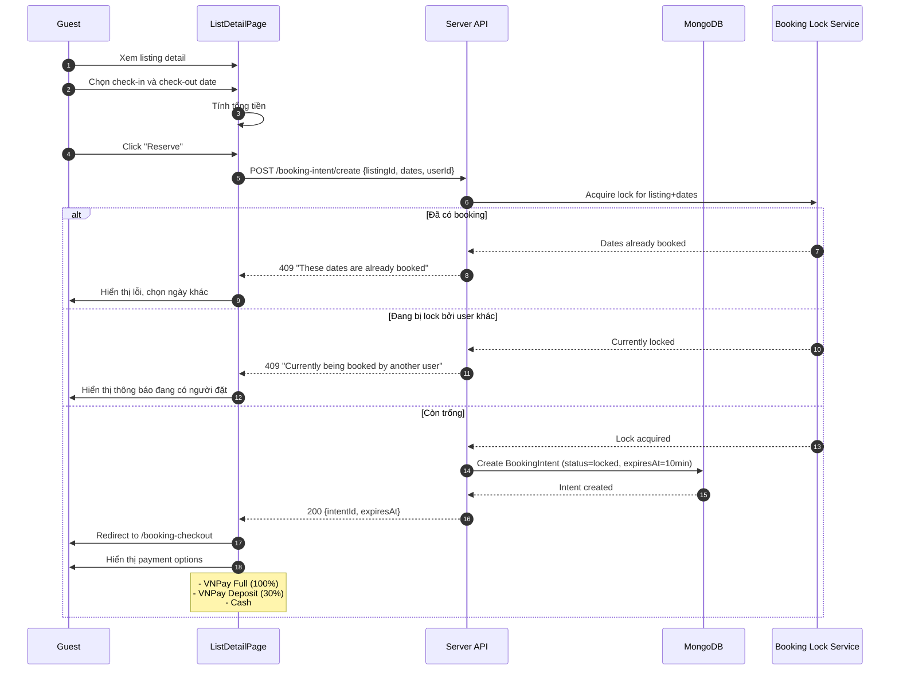
```mermaid
sequenceDiagram
    autonumber
    participant G as Guest
    participant UI as ListDetailPage
    participant API as Server API
    participant DB as MongoDB
    participant Lock as Booking Lock Service

    G->>UI: Xem listing detail
    G->>UI: Chọn check-in và check-out date
    UI->>UI: Tính tổng tiền
    G->>UI: Click "Reserve"
    
    UI->>API: POST /booking-intent/create {listingId, dates, userId}
    API->>Lock: Acquire lock for listing+dates
    
    alt Đã có booking
        Lock-->>API: Dates already booked
        API-->>UI: 409 "These dates are already booked"
        UI->>G: Hiển thị lỗi, chọn ngày khác
    else Đang bị lock bởi user khác
        Lock-->>API: Currently locked
        API-->>UI: 409 "Currently being booked by another user"
        UI->>G: Hiển thị thông báo đang có người đặt
    else Còn trống
        Lock-->>API: Lock acquired
        API->>DB: Create BookingIntent (status=locked, expiresAt=10min)
        DB-->>API: Intent created
        API-->>UI: 200 {intentId, expiresAt}
        UI->>G: Redirect to /booking-checkout
        UI->>G: Hiển thị payment options
        Note over UI: - VNPay Full (100%)<br/>- VNPay Deposit (30%)<br/>- Cash
    end
```

---

### SD16: Thanh toán VNPay Full/Deposit (UC16)

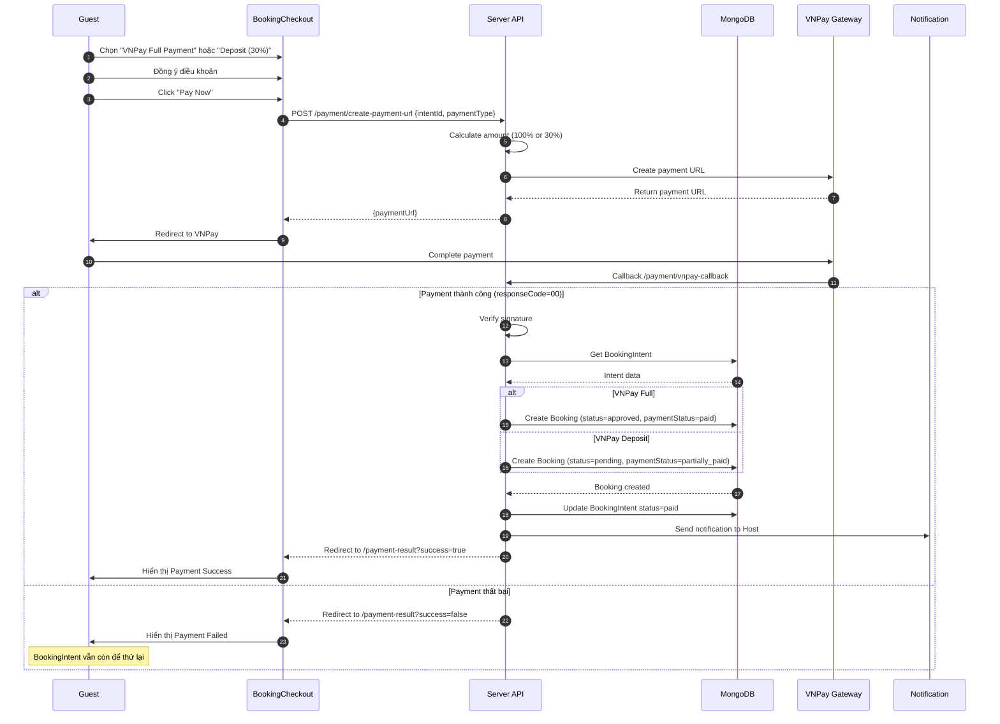
```mermaid
sequenceDiagram
    autonumber
    participant G as Guest
    participant UI as BookingCheckout
    participant API as Server API
    participant DB as MongoDB
    participant VNPay as VNPay Gateway
    participant Notif as Notification

    G->>UI: Chọn "VNPay Full Payment" hoặc "Deposit (30%)"
    G->>UI: Đồng ý điều khoản
    G->>UI: Click "Pay Now"
    
    UI->>API: POST /payment/create-payment-url {intentId, paymentType}
    API->>API: Calculate amount (100% or 30%)
    API->>VNPay: Create payment URL
    VNPay-->>API: Return payment URL
    API-->>UI: {paymentUrl}
    UI->>G: Redirect to VNPay
    
    G->>VNPay: Complete payment
    VNPay->>API: Callback /payment/vnpay-callback
    
    alt Payment thành công (responseCode=00)
        API->>API: Verify signature
        API->>DB: Get BookingIntent
        DB-->>API: Intent data
        
        alt VNPay Full
            API->>DB: Create Booking (status=approved, paymentStatus=paid)
        else VNPay Deposit
            API->>DB: Create Booking (status=pending, paymentStatus=partially_paid)
        end
        
        DB-->>API: Booking created
        API->>DB: Update BookingIntent status=paid
        API->>Notif: Send notification to Host
        API-->>UI: Redirect to /payment-result?success=true
        UI->>G: Hiển thị Payment Success
    else Payment thất bại
        API-->>UI: Redirect to /payment-result?success=false
        UI->>G: Hiển thị Payment Failed
        Note over G: BookingIntent vẫn còn để thử lại
    end
```

---

### SD17: Thanh toán Cash (UC17)

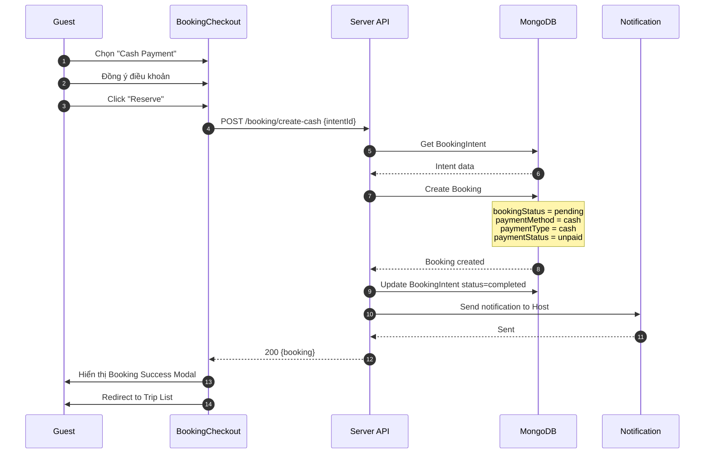
```mermaid
sequenceDiagram
    autonumber
    participant G as Guest
    participant UI as BookingCheckout
    participant API as Server API
    participant DB as MongoDB
    participant Notif as Notification

    G->>UI: Chọn "Cash Payment"
    G->>UI: Đồng ý điều khoản
    G->>UI: Click "Reserve"
    
    UI->>API: POST /booking/create-cash {intentId}
    API->>DB: Get BookingIntent
    DB-->>API: Intent data
    
    API->>DB: Create Booking
    Note over DB: bookingStatus = pending<br/>paymentMethod = cash<br/>paymentType = cash<br/>paymentStatus = unpaid
    DB-->>API: Booking created
    
    API->>DB: Update BookingIntent status=completed
    API->>Notif: Send notification to Host
    Notif-->>API: Sent
    
    API-->>UI: 200 {booking}
    UI->>G: Hiển thị Booking Success Modal
    UI->>G: Redirect to Trip List
```

---

### SD18: Host chấp nhận/từ chối booking (UC18)

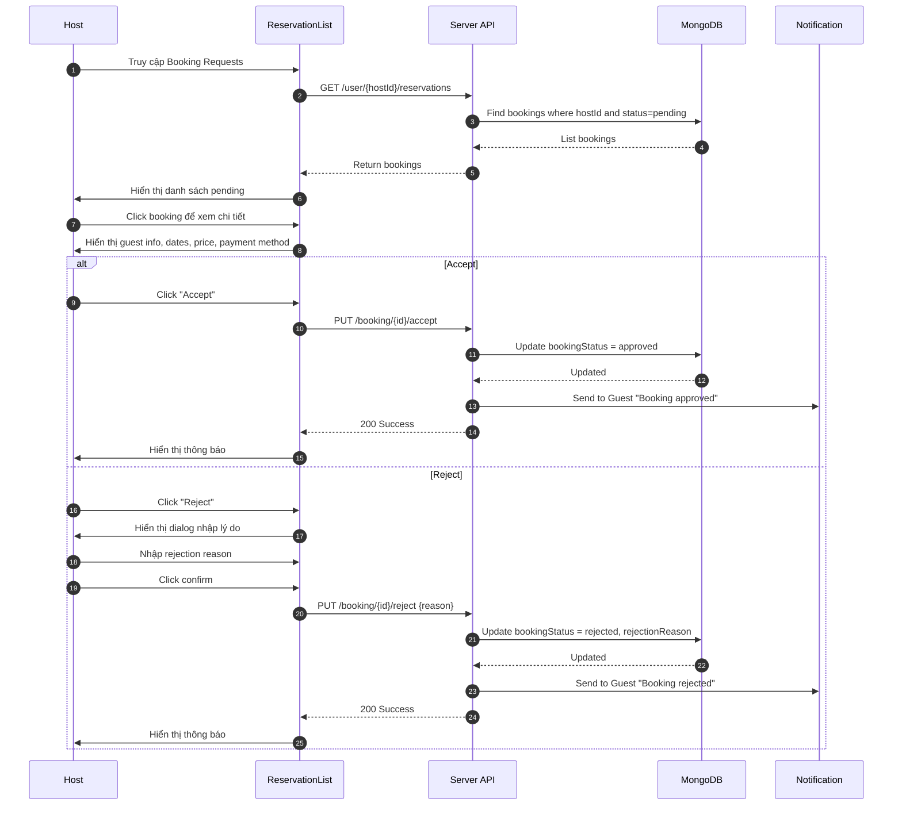
```mermaid
sequenceDiagram
    autonumber
    participant H as Host
    participant UI as ReservationList
    participant API as Server API
    participant DB as MongoDB
    participant Notif as Notification

    H->>UI: Truy cập Booking Requests
    UI->>API: GET /user/{hostId}/reservations
    API->>DB: Find bookings where hostId and status=pending
    DB-->>API: List bookings
    API-->>UI: Return bookings
    UI->>H: Hiển thị danh sách pending
    
    H->>UI: Click booking để xem chi tiết
    UI->>H: Hiển thị guest info, dates, price, payment method
    
    alt Accept
        H->>UI: Click "Accept"
        UI->>API: PUT /booking/{id}/accept
        API->>DB: Update bookingStatus = approved
        DB-->>API: Updated
        API->>Notif: Send to Guest "Booking approved"
        API-->>UI: 200 Success
        UI->>H: Hiển thị thông báo
    else Reject
        H->>UI: Click "Reject"
        UI->>H: Hiển thị dialog nhập lý do
        H->>UI: Nhập rejection reason
        H->>UI: Click confirm
        UI->>API: PUT /booking/{id}/reject {reason}
        API->>DB: Update bookingStatus = rejected, rejectionReason
        DB-->>API: Updated
        API->>Notif: Send to Guest "Booking rejected"
        API-->>UI: 200 Success
        UI->>H: Hiển thị thông báo
    end
```

---

### SD21: Hủy đặt phòng (UC21)

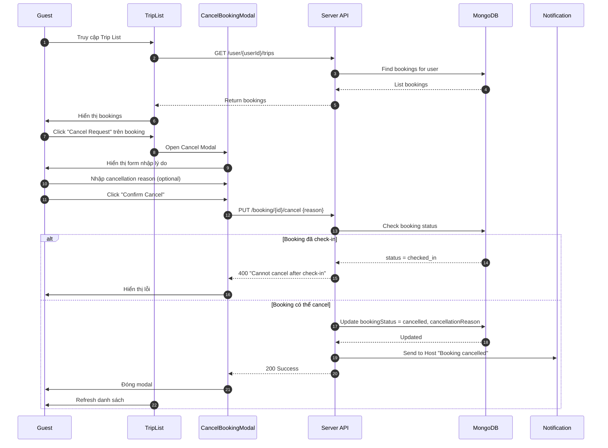
```mermaid
sequenceDiagram
    autonumber
    participant G as Guest
    participant UI as TripList
    participant Modal as CancelBookingModal
    participant API as Server API
    participant DB as MongoDB
    participant Notif as Notification

    G->>UI: Truy cập Trip List
    UI->>API: GET /user/{userId}/trips
    API->>DB: Find bookings for user
    DB-->>API: List bookings
    API-->>UI: Return bookings
    UI->>G: Hiển thị bookings
    
    G->>UI: Click "Cancel Request" trên booking
    UI->>Modal: Open Cancel Modal
    Modal->>G: Hiển thị form nhập lý do
    G->>Modal: Nhập cancellation reason (optional)
    G->>Modal: Click "Confirm Cancel"
    
    Modal->>API: PUT /booking/{id}/cancel {reason}
    API->>DB: Check booking status
    
    alt Booking đã check-in
        DB-->>API: status = checked_in
        API-->>Modal: 400 "Cannot cancel after check-in"
        Modal->>G: Hiển thị lỗi
    else Booking có thể cancel
        API->>DB: Update bookingStatus = cancelled, cancellationReason
        DB-->>API: Updated
        API->>Notif: Send to Host "Booking cancelled"
        API-->>Modal: 200 Success
        Modal->>G: Đóng modal
        UI->>G: Refresh danh sách
    end
```

---

### SD19: Guest check-in (UC19)

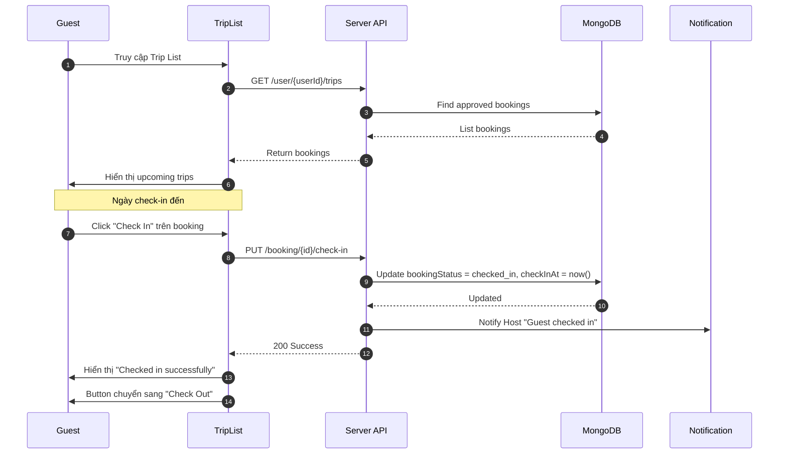
```mermaid
sequenceDiagram
    autonumber
    participant G as Guest
    participant UI as TripList
    participant API as Server API
    participant DB as MongoDB
    participant Notif as Notification

    G->>UI: Truy cập Trip List
    UI->>API: GET /user/{userId}/trips
    API->>DB: Find approved bookings
    DB-->>API: List bookings
    API-->>UI: Return bookings
    UI->>G: Hiển thị upcoming trips
    
    Note over G,UI: Ngày check-in đến
    
    G->>UI: Click "Check In" trên booking
    UI->>API: PUT /booking/{id}/check-in
    API->>DB: Update bookingStatus = checked_in, checkInAt = now()
    DB-->>API: Updated
    API->>Notif: Notify Host "Guest checked in"
    API-->>UI: 200 Success
    UI->>G: Hiển thị "Checked in successfully"
    UI->>G: Button chuyển sang "Check Out"
```

---

### SD20: Guest check-out (UC20)

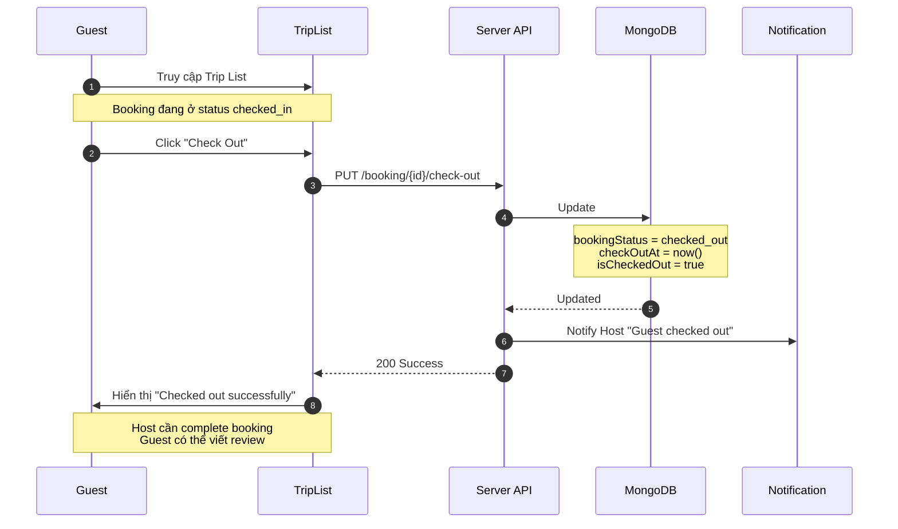
```mermaid
sequenceDiagram
    autonumber
    participant G as Guest
    participant UI as TripList
    participant API as Server API
    participant DB as MongoDB
    participant Notif as Notification

    G->>UI: Truy cập Trip List
    Note over G,UI: Booking đang ở status checked_in
    
    G->>UI: Click "Check Out"
    UI->>API: PUT /booking/{id}/check-out
    API->>DB: Update
    Note over DB: bookingStatus = checked_out<br/>checkOutAt = now()<br/>isCheckedOut = true
    DB-->>API: Updated
    
    API->>Notif: Notify Host "Guest checked out"
    API-->>UI: 200 Success
    UI->>G: Hiển thị "Checked out successfully"
    
    Note over G,UI: Host cần complete booking<br/>Guest có thể viết review
```

---

### SD22: Xem lịch sử booking (UC22)

```mermaid
sequenceDiagram
    autonumber
    participant G as Guest
    participant UI as BookingHistory
    participant API as Server API
    participant DB as MongoDB

    G->>UI: Truy cập Booking History
    UI->>API: GET /user/{userId}/booking-history
    API->>DB: Find all bookings for user
    Note over DB: Filter by status:<br/>- completed<br/>- cancelled<br/>- rejected<br/>- checked_out
    DB-->>API: Booking history
    API-->>UI: Return bookings
    
    UI->>G: Hiển thị danh sách với:
    Note over G,UI: - Listing info & photos<br/>- Dates<br/>- Total price<br/>- Payment method<br/>- Status<br/>- Transaction details<br/>- Review button (if completed)
    
    G->>UI: Click vào booking để xem chi tiết
    UI->>API: GET /booking/{id}
    API->>DB: Get full booking details
    DB-->>API: Booking data
    API-->>UI: Return details
    UI->>G: Hiển thị đầy đủ thông tin booking
```

---

## 4. PROCESS 2 - ROOM RENTAL

### SD30: Tạo listing Room (UC30)

```mermaid
sequenceDiagram
    autonumber
    participant H as Host
    participant UI as CreateListing
    participant Verify as VerificationCheck
    participant API as Server API
    participant DB as MongoDB
    participant Cloud as Cloudinary

    H->>UI: Click "Become a Host"
    UI->>H: Hiển thị type selection popup
    H->>UI: Chọn "Room(s)"
    
    UI->>Verify: Check identity verification
    Verify->>API: GET /identity-verification/{userId}/status
    API->>DB: Check verification
    DB-->>API: Verification status
    API-->>Verify: Return status
    
    alt Status != approved
        Verify->>H: Redirect to Identity Verification
        Note over H: Phải hoàn tất verification trước
    else Status == approved
        UI->>H: Hiển thị form tạo Room
        
        H->>UI: Nhập thông tin:
        Note over H,UI: - Title, description<br/>- Monthly rent<br/>- Room area (m²)<br/>- Deposit amount<br/>- Move-in date<br/>- Notice period<br/>- House rules<br/>- Lifestyle preferences<br/>- Upload photos
        
        H->>UI: Click "Publish Room"
        
        UI->>Cloud: Upload photos
        Cloud-->>UI: Return URLs
        
        UI->>API: POST /room-rental/rooms/create
        API->>DB: Create Room listing
        Note over DB: type = "Room(s)"<br/>status = AVAILABLE<br/>pricingType = MONTHLY
        DB-->>API: Created
        API-->>UI: 201 Created
        UI->>H: Redirect to room detail
    end
```

---

### SD31: Tìm kiếm Room (UC31)

```mermaid
sequenceDiagram
    autonumber
    participant T as Tenant/User
    participant UI as RoomRentalSearch
    participant API as Server API
    participant DB as MongoDB

    T->>UI: Truy cập Room Rental Search hoặc từ homepage
    UI->>T: Hiển thị search filters
    
    T->>UI: Nhập location (optional)
    T->>UI: Chọn budget range (optional)
    T->>UI: Chọn move-in date (optional)
    T->>UI: Chọn lifestyle preferences (optional)
    T->>UI: Click "Search Rooms"
    
    UI->>API: GET /room-rental/search?params
    API->>DB: Query room listings
    Note over DB: Filter by:<br/>- type = "Room(s)"<br/>- status = AVAILABLE<br/>- location, budget<br/>- move-in date<br/>- lifestyle match
    DB-->>API: Matching rooms
    API-->>UI: Return results
    UI->>T: Hiển thị room cards với:
    Note over T,UI: - Photos<br/>- Monthly rent<br/>- Room area<br/>- Location<br/>- Host info<br/>- Lifestyle tags
```

---

### SD32: Xem chi tiết Room (UC32)

```mermaid
sequenceDiagram
    autonumber
    participant T as Tenant/User
    participant UI as RoomRentalDetail
    participant API as Server API
    participant DB as MongoDB

    T->>UI: Click vào room card
    UI->>API: GET /room-rental/rooms/{id}
    API->>DB: Get room details
    DB-->>API: Room data
    API-->>UI: Return room
    
    UI->>API: GET /reviews/room/{id}
    API->>DB: Get reviews
    DB-->>API: Reviews list
    API-->>UI: Return reviews
    
    UI->>T: Hiển thị:
    Note over T,UI: - Photos slider<br/>- Title, description<br/>- Monthly rent<br/>- Room area<br/>- Deposit amount<br/>- Available from date<br/>- House rules<br/>- Lifestyle preferences<br/>- Host profile<br/>- Reviews<br/>- "Request to Rent" button
    
    alt User chưa đăng nhập
        UI->>T: Hiển thị "Login to request"
    end
```

---

### SD33: Gửi yêu cầu thuê phòng (UC33)

```mermaid
sequenceDiagram
    autonumber
    participant T as Tenant
    participant UI as RoomRentalDetail
    participant Verify as VerificationCheck
    participant API as Server API
    participant DB as MongoDB
    participant Notif as Notification

    T->>UI: Đang xem room detail
    T->>UI: Click "Request to Rent"
    
    UI->>Verify: Check identity verification
    Verify->>API: GET /identity-verification/{userId}/status
    API->>DB: Check verification
    DB-->>API: Verification status
    API-->>Verify: Return status
    
    alt Status != approved
        Verify->>T: Hiển thị dialog yêu cầu verification
        T->>Verify: Click "Verify My Identity"
        Verify->>T: Redirect to Identity Verification form
    else Status == approved
        UI->>T: Hiển thị request dialog
        T->>UI: Nhập introduction message
        T->>UI: Chọn move-in date
        T->>UI: Chọn intended stay duration (months)
        T->>UI: Click "Send Request"
        
        UI->>API: POST /room-rental/request
        Note over API: {<br/>  roomId,<br/>  tenantId,<br/>  message,<br/>  moveInDate,<br/>  duration<br/>}
        
        API->>DB: Check room availability
        alt Room không available
            DB-->>API: Room locked/rented
            API-->>UI: 409 Room not available
            UI->>T: "Room is currently unavailable"
        else Room available
            API->>DB: Create RentalRequest
            Note over DB: status = REQUESTED
            DB-->>API: Created
            
            API->>Notif: Notify Host "New rental request"
            API-->>UI: 201 Created
            UI->>T: "Request sent successfully"
        end
    end
```

---

### SD34: Host xem yêu cầu thuê (UC34)

```mermaid
sequenceDiagram
    autonumber
    participant H as Host
    participant UI as HostRequests
    participant API as Server API
    participant DB as MongoDB

    H->>UI: Truy cập Host Requests
    UI->>API: GET /room-rental/host/{hostId}/requests
    API->>DB: Find rental requests for host's rooms
    Note over DB: Filter by:<br/>- status = REQUESTED<br/>- room belongs to host
    DB-->>API: List requests
    API-->>UI: Return requests
    
    UI->>H: Hiển thị danh sách requests với:
    Note over H,UI: - Tenant info & photo<br/>- Room info<br/>- Move-in date<br/>- Duration<br/>- Introduction message<br/>- Request date<br/>- Buttons: Accept / Reject / Chat
    
    H->>UI: Click vào request để xem chi tiết
    UI->>API: GET /room-rental/requests/{id}
    API->>DB: Get full request details
    DB-->>API: Request data
    API-->>UI: Return details
    UI->>H: Hiển thị đầy đủ thông tin tenant
```

---

### SD35: Host chấp nhận/từ chối yêu cầu (UC35)

```mermaid
sequenceDiagram
    autonumber
    participant T as Tenant
    participant UI as RoomRentalDetail
    participant API as Server API
    participant DB as MongoDB
    participant Notif as Notification

    T->>UI: Xem chi tiết phòng
    T->>UI: Click "Request to Rent"
    
    UI->>API: GET /identity-verification/{userId}/status
    API->>DB: Check verification
    
    alt Chưa xác thực
        DB-->>API: Not found or rejected
        API-->>UI: {exists: false}
        UI->>T: Hiển thị dialog "Verify Identity Required"
        T->>UI: Click "Verify My Identity"
        UI->>T: Redirect to verification form
    else Đang pending
        DB-->>API: status = pending
        API-->>UI: {status: pending}
        UI->>T: Hiển thị "Verification pending approval"
    else Đã approved
        DB-->>API: status = approved
        API-->>UI: {status: approved}
        
        UI->>T: Hiển thị Request Form
        T->>UI: Nhập message giới thiệu (50-1000 chars)
        T->>UI: Chọn ngày dọn vào dự kiến
        T->>UI: Nhập thời gian ở (tháng)
        T->>UI: Click "Submit Request"
        
        UI->>API: POST /room-rental/request {roomId, message, moveInDate, duration}
        API->>DB: Check room availability
        
        alt Phòng đã có người thuê
            DB-->>API: Room not available
            API-->>UI: 400 "Room not available"
            UI->>T: Hiển thị lỗi
        else Phòng còn trống
            API->>DB: Create RentalRequest (status=REQUESTED)
            DB-->>API: Created
            API->>Notif: Notify Host
            API-->>UI: 200 Success
            UI->>T: Hiển thị thông báo thành công
        end
    end
```

---

### SD35: Host chấp nhận/từ chối yêu cầu (UC35)

```mermaid
sequenceDiagram
    autonumber
    participant H as Host
    participant UI as HostRequests
    participant API as Server API
    participant DB as MongoDB
    participant Notif as Notification

    H->>UI: Truy cập Room Rental Requests
    UI->>API: GET /room-rental/host/{hostId}/requests
    API->>DB: Find requests for host's rooms
    DB-->>API: List requests
    API-->>UI: Return requests
    UI->>H: Hiển thị danh sách
    
    H->>UI: Click request để xem chi tiết
    UI->>H: Hiển thị tenant info, message, dates
    
    alt Approve
        H->>UI: Click "Approve"
        UI->>API: PUT /room-rental/requests/{id}/approve
        API->>DB: Update request status = APPROVED
        API->>DB: Create RentalAgreement (status=DRAFT)
        DB-->>API: Agreement created
        API->>DB: Update room availability = false
        API->>Notif: Notify Tenant "Request approved"
        API-->>UI: 200 Success
        UI->>H: Hiển thị thông báo
    else Reject
        H->>UI: Click "Reject"
        UI->>H: Hiển thị dialog nhập lý do
        H->>UI: Nhập reason
        UI->>API: PUT /room-rental/requests/{id}/reject {reason}
        API->>DB: Update request status = REJECTED
        API->>Notif: Notify Tenant "Request rejected"
        API-->>UI: 200 Success
    end
```

---

### SD36: Tạo Agreement (UC36)

```mermaid
sequenceDiagram
    autonumber
    participant H as Host
    participant API as Server API
    participant DB as MongoDB
    participant Notif as Notification

    Note over H,Notif: Triggered when Host approves request
    
    H->>API: PUT /room-rental/requests/{id}/approve
    API->>DB: Update request status = APPROVED
    
    API->>DB: Get room details
    DB-->>API: Room {monthlyRent, ...}
    
    API->>DB: Create RentalAgreement
    Note over DB: roomId, tenantId, hostId<br/>rentAmount = monthlyRent<br/>depositAmount = monthlyRent<br/>paymentMethod = CASH<br/>noticePeriod = 30 days<br/>status = DRAFT
    DB-->>API: Agreement created
    
    API->>Notif: Send to Tenant "Agreement ready to sign"
    Notif-->>API: Sent
    
    API-->>H: 200 {request, agreement}
```

---

### SD37: Tenant ký Agreement (UC37)

```mermaid
sequenceDiagram
    autonumber
    participant T as Tenant
    participant UI as MyAgreements
    participant API as Server API
    participant DB as MongoDB
    participant Notif as Notification

    T->>UI: Truy cập My Agreements
    UI->>API: GET /room-rental/tenant/{tenantId}/agreements
    API->>DB: Find agreements for tenant
    DB-->>API: List agreements
    API-->>UI: Return agreements
    UI->>T: Hiển thị agreements
    
    T->>UI: Click agreement (status=DRAFT)
    UI->>T: Hiển thị chi tiết agreement
    T->>UI: Click "Accept Agreement"
    UI->>T: Confirmation dialog
    T->>UI: Confirm
    
    UI->>API: PUT /room-rental/agreements/{id}/tenant-sign
    API->>DB: Update agreedByTenantAt = now()
    
    API->>DB: Check if host already signed
    alt Host đã ký
        DB-->>API: agreedByHostAt exists
        API->>DB: Update status = ACTIVE
        API->>DB: Create initial deposit payment record
        API->>Notif: Notify both "Agreement is now active"
    else Host chưa ký
        DB-->>API: agreedByHostAt = null
        API->>Notif: Notify Host "Tenant signed, waiting for your signature"
    end
    
    DB-->>API: Updated
    API-->>UI: 200 Success
    UI->>T: Hiển thị thông báo
```

---

### SD38: Host ký Agreement (UC38)

```mermaid
sequenceDiagram
    autonumber
    participant H as Host
    participant UI as HostAgreements
    participant API as Server API
    participant DB as MongoDB
    participant Notif as Notification

    H->>UI: Truy cập Host Agreements
    UI->>API: GET /room-rental/host/{hostId}/agreements
    API->>DB: Find agreements for host
    Note over DB: Filter by status = DRAFT
    DB-->>API: List agreements
    API-->>UI: Return agreements
    UI->>H: Hiển thị agreements chờ ký
    
    H->>UI: Click "Review Agreement"
    UI->>H: Hiển thị agreement details
    Note over H,UI: - Tenant info<br/>- Room info<br/>- Monthly rent<br/>- Deposit<br/>- Notice period<br/>- House rules<br/>- Tenant đã ký
    
    H->>UI: Đọc và xác nhận terms
    H->>UI: Click "Sign Agreement"
    
    UI->>API: PUT /room-rental/agreements/{id}/host-sign
    API->>DB: Update agreement
    Note over DB: agreedByHostAt = now()<br/>status = ACTIVE
    DB-->>API: Updated
    
    API->>Notif: Notify Tenant "Agreement is now active"
    API-->>UI: 200 Success
    UI->>H: "Agreement signed successfully"
    
    Note over H,UI: Tenant có thể move-in và thanh toán
```

---

### SD39: Quản lý thanh toán hàng tháng (UC39)

```mermaid
sequenceDiagram
    autonumber
    participant T as Tenant
    participant H as Host
    participant UI as PaymentManagement
    participant API as Server API
    participant DB as MongoDB
    participant Notif as Notification
    participant Cron as CronJob

    Note over Cron,DB: Tự động tạo monthly payment records
    
    Cron->>API: Chạy hàng tháng
    API->>DB: Find active agreements
    DB-->>API: List agreements
    
    loop Mỗi agreement
        API->>DB: Create RentalPayment
        Note over DB: type = MONTHLY<br/>status = UNPAID<br/>amount = monthly rent<br/>dueDate = ngày 1 hàng tháng
        DB-->>API: Created
        API->>Notif: Notify Tenant "Rent payment due"
    end
    
    T->>UI: Truy cập My Payments
    UI->>API: GET /room-rental/tenant/{tenantId}/payments
    API->>DB: Get payments for tenant
    DB-->>API: Payment list
    API-->>UI: Return payments
    UI->>T: Hiển thị upcoming payments
    
    alt Tenant thanh toán online
        T->>UI: Click "Pay Now" (VNPay)
        UI->>API: POST /room-rental/payments/{id}/pay-vnpay
        Note over T,API: Tương tự flow VNPay ở UC16
        API-->>T: Redirect to VNPay
        T->>T: Thanh toán
        Note over T: VNPay callback
        API->>DB: Update payment status = PAID
    else Tenant thanh toán cash
        T->>H: Thanh toán tiền mặt trực tiếp
        H->>UI: Truy cập Host Payments
        H->>UI: Click "Confirm Cash Payment"
        UI->>API: PUT /room-rental/payments/{id}/confirm-cash
        API->>DB: Update status = PAID, method = CASH
        DB-->>API: Updated
        API->>Notif: Notify Tenant "Payment confirmed"
        API-->>UI: Success
    end
```

---

### SD40: Move-in xác nhận (UC40)

```mermaid
sequenceDiagram
    autonumber
    participant T as Tenant
    participant H as Host
    participant UI as RentalManagement
    participant API as Server API
    participant DB as MongoDB
    participant Notif as Notification

    Note over T,H: Agreement đã ACTIVE<br/>Deposit đã thanh toán<br/>Move-in date đến
    
    T->>UI: Truy cập My Rentals
    UI->>API: GET /room-rental/tenant/{tenantId}/rentals
    API->>DB: Find rental for tenant
    Note over DB: status = PENDING_MOVE_IN
    DB-->>API: Rental data
    API-->>UI: Return rental
    UI->>T: Hiển thị "Confirm Move-In" button
    
    T->>UI: Click "Confirm Move-In"
    UI->>API: PUT /room-rental/rentals/{id}/confirm-move-in
    API->>DB: Update rental
    Note over DB: status = ACTIVE<br/>moveInConfirmedAt = now()
    DB-->>API: Updated
    
    API->>Notif: Notify Host "Tenant moved in"
    API-->>UI: 200 Success
    UI->>T: "Move-in confirmed"
    
    Note over T,H: Monthly rent cycle bắt đầu
```

---

### SD41: Kết thúc thuê phòng (UC41)

```mermaid
sequenceDiagram
    autonumber
    participant T as Tenant
    participant H as Host
    participant UI as RentalManagement
    participant API as Server API
    participant DB as MongoDB
    participant Notif as Notification

    alt Tenant muốn kết thúc
        T->>UI: Truy cập My Rentals
        T->>UI: Click "Terminate Rental"
        UI->>T: Hiển thị notice period warning
        T->>UI: Confirm termination
        T->>UI: Nhập reason (optional)
        
        UI->>API: POST /room-rental/rentals/{id}/terminate
        API->>DB: Update rental status = TERMINATING
        Note over DB: terminationDate = now() + notice_period
        DB-->>API: Updated
        API->>Notif: Notify Host "Tenant terminating rental"
        
    else Host muốn kết thúc
        H->>UI: Truy cập Host Rentals
        H->>UI: Click "Terminate Rental"
        UI->>H: Nhập termination reason
        H->>UI: Confirm
        
        UI->>API: POST /room-rental/rentals/{id}/terminate
        API->>DB: Update status = TERMINATING
        DB-->>API: Updated
        API->>Notif: Notify Tenant "Host terminating rental"
    end
    
    Note over T,H: Đợi notice period hết
    
    T->>UI: Confirm move-out
    UI->>API: PUT /room-rental/rentals/{id}/move-out
    API->>DB: Update status = COMPLETED, moveOutAt = now()
    
    H->>UI: Inspect room
    H->>UI: Confirm move-out completion
    UI->>API: PUT /room-rental/rentals/{id}/complete
    API->>DB: Update agreement status = TERMINATED
    
    Note over API,DB: Handle deposit refund (full/partial)
    
    API->>Notif: Notify both parties "Rental completed"
    API-->>UI: Success
```

---

### SD42: Xem danh sách thuê (UC42)

```mermaid
sequenceDiagram
    autonumber
    participant T as Tenant
    participant UI as MyRentals
    participant API as Server API
    participant DB as MongoDB

    T->>UI: Truy cập My Rentals
    UI->>API: GET /room-rental/tenant/{tenantId}/rentals
    API->>DB: Find rentals for tenant
    Note over DB: Include:<br/>- room details<br/>- host info<br/>- agreement<br/>- payment status
    DB-->>API: List rentals
    API-->>UI: Return rentals
    
    UI->>T: Hiển thị tabs:
    Note over T,UI: - Active Rentals<br/>- Past Rentals<br/>- Terminating
    
    UI->>T: Hiển thị mỗi rental với:
    Note over T,UI: - Room photo & title<br/>- Host info<br/>- Monthly rent<br/>- Move-in date<br/>- Rental status<br/>- Next payment due<br/>- Action buttons
    
    T->>UI: Click vào rental để xem chi tiết
    UI->>API: GET /room-rental/rentals/{id}
    API->>DB: Get full rental details
    DB-->>API: Rental data with agreement & payments
    API-->>UI: Return details
    UI->>T: Hiển thị đầy đủ:
    Note over T,UI: - Agreement terms<br/>- Payment history<br/>- Messages with host<br/>- Terminate option
```

---

## 5. PROCESS 3 - ROOMMATE MATCHING

### SD50: Tạo bài đăng tìm bạn cùng phòng (UC50)

```mermaid
sequenceDiagram
    autonumber
    participant U as User
    participant UI as RoommatePostForm
    participant API as Server API
    participant DB as MongoDB
    participant Cloud as Cloudinary

    U->>UI: Click "Become a Host"
    UI->>U: Hiển thị type selection
    U->>UI: Chọn "A Shared Room"
    
    UI->>API: GET /identity-verification/{userId}/status
    API->>DB: Check verification
    
    alt Chưa verified
        DB-->>API: Not approved
        UI->>U: Redirect to verification form
    else Đã verified
        DB-->>API: status = approved
        UI->>U: Hiển thị Roommate Post Form
        
        U->>UI: Chọn post type (SEEKER/PROVIDER)
        U->>UI: Nhập title, description
        U->>UI: Nhập location
        U->>UI: Nhập budget min-max
        U->>UI: Chọn move-in date
        U->>UI: Chọn gender preference
        U->>UI: Chọn lifestyle preferences
        U->>UI: Chọn contact method
        U->>UI: Upload photos (optional)
        U->>UI: Click "Create Post"
        
        alt Có photos
            UI->>Cloud: Upload photos
            Cloud-->>UI: Return URLs
        end
        
        UI->>API: POST /roommate/posts {postData}
        API->>DB: Create RoommatePost (status=ACTIVE)
        DB-->>API: Post created
        API-->>UI: 200 {post}
        UI->>U: Redirect to /roommate/posts/{id}
    end
```

---

### SD51: Tìm kiếm bài đăng Roommate (UC51)

```mermaid
sequenceDiagram
    autonumber
    participant U as User
    participant UI as RoommateSearch
    participant API as Server API
    participant DB as MongoDB

    U->>UI: Truy cập Roommate Search hoặc từ homepage
    UI->>U: Hiển thị search filters
    
    U->>UI: Nhập location (optional)
    U->>UI: Chọn budget range (optional)
    U->>UI: Chọn move-in date (optional)
    U->>UI: Chọn gender preference (optional)
    U->>UI: Chọn lifestyle filters (optional)
    U->>UI: Click "Search"
    
    UI->>API: GET /roommate/posts/search?params
    API->>DB: Query roommate posts
    Note over DB: Filter by:<br/>- status = ACTIVE<br/>- location, budget<br/>- move-in date<br/>- gender<br/>- lifestyle match
    DB-->>API: Matching posts
    API-->>UI: Return results
    
    UI->>U: Hiển thị post cards với:
    Note over U,UI: - User photo<br/>- Post type (Seeker/Provider)<br/>- Location<br/>- Budget<br/>- Move-in date<br/>- Lifestyle tags<br/>- Match score (optional)
```

---

### SD52: Xem chi tiết bài đăng (UC52)

```mermaid
sequenceDiagram
    autonumber
    participant U as User
    participant UI as RoommatePostDetail
    participant API as Server API
    participant DB as MongoDB

    U->>UI: Click vào post card
    UI->>API: GET /roommate/posts/{id}
    API->>DB: Get post details
    DB-->>API: Post data
    API-->>UI: Return post
    
    UI->>API: GET /user/{posterId}
    API->>DB: Get poster profile
    DB-->>API: User profile
    API-->>UI: Return profile
    
    UI->>U: Hiển thị:
    Note over U,UI: - Post photos<br/>- Description<br/>- Budget range<br/>- Move-in date<br/>- Location<br/>- Gender preference<br/>- Lifestyle details:<br/>  - Sleep schedule<br/>  - Smoking<br/>  - Pets<br/>  - Cleanliness<br/>- Contact preference<br/>- "Send Request" button
    
    alt Own post
        UI->>U: Hiển thị "Edit" & "Close Post"
    else Other's post
        UI->>U: Hiển thị "Send Request"
    end
```

---

### SD53: Gửi yêu cầu kết nối (UC53)

```mermaid
sequenceDiagram
    autonumber
    participant U as User
    participant UI as RoommatePostDetail
    participant API as Server API
    participant DB as MongoDB
    participant Notif as Notification

    U->>UI: Xem bài đăng roommate
    
    alt Bài đăng của chính user
        UI->>U: Ẩn nút "Send Request"
    else Post status != ACTIVE
        UI->>U: Hiển thị "This post is no longer active"
    else Post của người khác và ACTIVE
        U->>UI: Click "Send Request"
        
        UI->>API: GET /identity-verification/{userId}/status
        alt Chưa verified
            API-->>UI: Not approved
            UI->>U: Yêu cầu xác thực danh tính
        else Đã verified
            UI->>U: Hiển thị dialog nhập message
            U->>UI: Nhập message
            U->>UI: Click "Send"
            
            UI->>API: POST /roommate/requests {postId, message}
            API->>DB: Check existing request
            
            alt Đã gửi request rồi
                DB-->>API: Request exists
                API-->>UI: 400 "Already sent request"
                UI->>U: Hiển thị lỗi
            else Chưa có request
                API->>DB: Create RoommateRequest (status=PENDING)
                DB-->>API: Created
                API->>Notif: Notify post owner
                API-->>UI: 200 Success
                UI->>U: Hiển thị thông báo thành công
            end
        end
    end
```

---

### SD54: Chấp nhận/Từ chối yêu cầu (UC54)

```mermaid
sequenceDiagram
    autonumber
    participant O as Post Owner
    participant UI as MyRoommateRequests
    participant API as Server API
    participant DB as MongoDB
    participant Notif as Notification

    O->>UI: Truy cập Roommate Requests
    UI->>API: GET /roommate/requests/received
    API->>DB: Find requests for user's posts (status=PENDING)
    DB-->>API: List requests
    API-->>UI: Return requests with sender info
    UI->>O: Hiển thị danh sách requests
    
    O->>UI: Click vào request để xem detail
    UI->>O: Hiển thị:
    Note over O,UI: - Sender profile & photo<br/>- Request message<br/>- Sender's preferences<br/>- Move-in date<br/>- Budget<br/>- Lifestyle info
    
    alt Owner quyết định Accept
        O->>UI: Click "Accept"
        UI->>API: PUT /roommate/requests/{id}/accept
        API->>DB: Update request status = ACCEPTED
        DB-->>API: Updated
        
        API->>DB: Create RoommateMatch
        API->>DB: Update post status = MATCHED
        API->>Notif: Notify sender "Your request was accepted!"
        API-->>UI: 200 Success
        UI->>O: "Request accepted - Match created"
        UI->>O: Enable chat with matched user
        
    else Owner quyết định Reject
        O->>UI: Click "Reject"
        UI->>API: PUT /roommate/requests/{id}/reject
        API->>DB: Update request status = REJECTED
        DB-->>API: Updated
        API->>Notif: Notify sender "Request was declined"
        API-->>UI: 200 Success
        UI->>O: "Request rejected"
    end
```

---

### SD55: Tạo Match (UC55)

```mermaid
sequenceDiagram
    autonumber
    participant O as Post Owner
    participant UI as MyRoommateRequests
    participant API as Server API
    participant DB as MongoDB
    participant Notif as Notification

    O->>UI: Truy cập Roommate Requests
    UI->>API: GET /roommate/requests/received
    API->>DB: Find requests for user's posts
    DB-->>API: List requests
    API-->>UI: Return requests
    UI->>O: Hiển thị danh sách
    
    O->>UI: Click request
    O->>UI: Click "Accept"
    
    UI->>API: PUT /roommate/requests/{id}/accept
    API->>DB: Update request status = ACCEPTED
    
    API->>DB: Create RoommateMatch
    Note over DB: postId, userA (owner), userB (requester)<br/>matchedAt = now()
    DB-->>API: Match created
    
    API->>DB: Update RoommatePost
    Note over DB: status = MATCHED<br/>matchedWith = requester
    DB-->>API: Updated
    
    API->>Notif: Notify requester "Match accepted!"
    API->>Notif: Notify owner "Match created!"
    
    API-->>UI: 200 {request, match}
    UI->>O: Hiển thị thành công
    Note over O,UI: Post không còn hiển thị trong search<br/>Cả hai có thể chat với nhau
```

---

### SD56: Chat với roommate (UC56)

```mermaid
sequenceDiagram
    autonumber
    participant U as User
    participant UI as MessagesPage
    participant Socket as Socket.IO
    participant API as Server API
    participant DB as MongoDB
    participant R as Roommate

    U->>UI: Click "Chat" trên matched post hoặc contact
    
    UI->>API: GET /conversation/find
    Note over API: Find conversation between<br/>user and roommate
    
    alt Conversation exists
        API->>DB: Find conversation
        DB-->>API: Conversation
    else Conversation not exists
        API->>DB: Create new conversation
        Note over DB: participants: [userId, roommateId]
        DB-->>API: New conversation created
    end
    
    API-->>UI: Return conversation
    
    UI->>API: GET /message/{conversationId}
    API->>DB: Get message history
    DB-->>API: Messages
    API-->>UI: Return messages
    UI->>U: Hiển thị chat interface
    
    U->>UI: Nhập message
    U->>UI: Click Send
    UI->>Socket: emit("sendMessage", {conversationId, text})
    Socket->>API: POST /message/create
    API->>DB: Save message
    DB-->>API: Message saved
    API->>Socket: Broadcast to conversation
    Socket->>R: emit("receiveMessage", message)
    Socket-->>U: Message sent confirmation
    UI->>U: Hiển thị message trong chat
```

---

### SD57: Chỉnh sửa bài đăng (UC57)

```mermaid
sequenceDiagram
    autonumber
    participant U as User (Owner)
    participant UI as RoommatePostDetail
    participant Edit as EditPostForm
    participant API as Server API
    participant DB as MongoDB
    participant Cloud as Cloudinary

    U->>UI: Xem own post
    UI->>U: Show "Edit Post" button
    U->>UI: Click "Edit Post"
    
    UI->>Edit: Open edit form với data hiện tại
    Edit->>U: Hiển thị form with prefilled data
    
    U->>Edit: Sửa thông tin:
    Note over U,Edit: - Location<br/>- Budget<br/>- Move-in date<br/>- Preferences<br/>- Description<br/>- Photos
    
    alt Upload new photos
        Edit->>Cloud: Upload new images
        Cloud-->>Edit: Return URLs
    end
    
    U->>Edit: Click "Update Post"
    
    Edit->>API: PUT /roommate/posts/{id}
    Note over API: Updated data
    
    API->>DB: Update RoommatePost
    DB-->>API: Updated
    API-->>Edit: 200 Success
    Edit->>U: "Post updated successfully"
    Edit->>UI: Redirect to post detail
    UI->>U: Show updated post
```

---

### SD58: Đóng bài đăng (UC58)

```mermaid
sequenceDiagram
    autonumber
    participant U as User (Owner)
    participant UI as RoommatePostDetail/MyPosts
    participant API as Server API
    participant DB as MongoDB

    U->>UI: Xem own post
    UI->>U: Show "Close Post" button
    
    U->>UI: Click "Close Post"
    UI->>U: Confirm dialog "Are you sure?"
    U->>UI: Confirm
    
    UI->>API: PUT /roommate/posts/{id}/close
    API->>DB: Update post status = CLOSED
    DB-->>API: Updated
    API-->>UI: 200 Success
    
    UI->>U: "Post closed successfully"
    Note over U,UI: - Post không còn hiển thị trong search<br/>- Requests mới bị block<br/>- Existing requests không bị ảnh hưởng
    
    alt From My Posts page
        UI->>U: Move post to "Closed" tab
    else From Post Detail
        UI->>U: Show "This post is closed" badge
        UI->>U: Hide "Send Request" button
    end
```

---

### SD59: Xem yêu cầu đã gửi (UC59)

```mermaid
sequenceDiagram
    autonumber
    participant U as User
    participant UI as MyRoommateRequests (Sent tab)
    participant API as Server API
    participant DB as MongoDB

    U->>UI: Truy cập /roommate/my-requests (Sent tab)
    
    UI->>API: GET /roommate/requests/sent
    API->>DB: Find requests where senderId = userId
    DB-->>API: List of sent requests
    API->>DB: Populate post and receiver info
    DB-->>API: Full request data
    API-->>UI: Return requests
    
    UI->>U: Hiển thị danh sách với:
    Note over U,UI: - Receiver avatar & name<br/>- Post info<br/>- Request message<br/>- Status badge:<br/>  - PENDING (yellow)<br/>  - ACCEPTED (green)<br/>  - REJECTED (red)<br/>- Sent date
    
    alt Filter by status
        U->>UI: Select filter (PENDING/ACCEPTED/REJECTED)
        UI->>U: Filter list client-side
    end
    
    U->>UI: Click vào request
    UI->>U: Hiển thị full details:
    Note over U,UI: - Post detail link<br/>- Message thread<br/>- Contact button (if accepted)
```

---

### SD60: Xem yêu cầu nhận được (UC60)

```mermaid
sequenceDiagram
    autonumber
    participant O as Owner
    participant UI as MyRoommateRequests (Received tab)
    participant API as Server API
    participant DB as MongoDB

    O->>UI: Truy cập /roommate/my-requests (Received tab)
    
    UI->>API: GET /roommate/requests/received
    API->>DB: Find requests for user's posts
    Note over DB: JOIN with RoommatePosts<br/>WHERE post.userId = userId
    DB-->>API: List of received requests
    API->>DB: Populate sender and post info
    DB-->>API: Full request data
    API-->>UI: Return requests
    
    UI->>O: Hiển thị danh sách với:
    Note over O,UI: - Sender avatar & name<br/>- Post title/location<br/>- Request message<br/>- Sender's move-in date<br/>- Status:<br/>  - PENDING (với Accept/Reject buttons)<br/>  - ACCEPTED (green)<br/>  - REJECTED (gray)<br/>- Received date
    
    O->>UI: Click vào request
    UI->>O: Show full details:
    Note over O,UI: - Sender profile<br/>- Full preferences<br/>- Lifestyle compatibility<br/>- Match score (optional)
    
    alt Status = PENDING
        O->>UI: Click "Accept" hoặc "Reject"
        Note over O,UI: Trigger SD54 flow
    end
```

---

## 6. MESSAGING

### SD70: Gửi tin nhắn (UC70)

```mermaid
sequenceDiagram
    autonumber
    participant S as Sender
    participant UI as MessagesPage
    participant Socket as Socket.IO
    participant API as Server API
    participant DB as MongoDB
    participant R as Receiver

    S->>UI: Mở conversation
    UI->>API: GET /message/{conversationId}
    API->>DB: Get messages
    DB-->>API: Messages history
    API-->>UI: Return messages
    UI->>S: Hiển thị chat history
    
    S->>UI: Nhập tin nhắn
    S->>UI: Click Send hoặc Enter
    
    UI->>API: POST /message/send {conversationId, content}
    API->>DB: Save message
    DB-->>API: Message saved
    
    API->>Socket: Emit 'new-message' to receiver
    Socket->>R: Real-time notification
    R->>R: Nhận tin nhắn ngay lập tức
    
    API-->>UI: 200 {message}
    UI->>S: Hiển thị message trong chat
```

---

### SD71: Xem danh sách hội thoại (UC71)

```mermaid
sequenceDiagram
    autonumber
    participant U as User
    participant UI as MessagesPage
    participant API as Server API
    participant DB as MongoDB

    U->>UI: Truy cập /messages
    
    UI->>API: GET /conversations/{userId}
    API->>DB: Find all conversations with userId
    Note over DB: Sort by last message time
    DB-->>API: List conversations
    API->>DB: Populate participant info & last message
    DB-->>API: Full conversation data
    API-->>UI: Return conversations
    
    UI->>U: Hiển thị conversation list:
    Note over U,UI: - Partner avatar & name<br/>- Last message preview<br/>- Timestamp<br/>- Unread count (if any)<br/>- Online status (green dot)
    
    U->>UI: Click vào conversation
    UI->>U: Load chat detail (trigger SD70)
```

---

### SD72: Xem lịch sử tin nhắn (UC72)

```mermaid
sequenceDiagram
    autonumber
    participant U as User
    participant UI as MessageThread
    participant API as Server API
    participant DB as MongoDB

    U->>UI: Mở conversation
    
    UI->>API: GET /message/{conversationId}?limit=50
    API->>DB: Get recent messages
    DB-->>API: Last 50 messages
    API-->>UI: Return messages
    
    UI->>U: Hiển thị messages:
    Note over U,UI: - Sender avatar<br/>- Message text<br/>- Timestamp<br/>- Read status (✓✓)<br/>- Alignment:<br/>  - Own messages: right<br/>  - Partner messages: left
    
    alt User scrolls to top
        U->>UI: Scroll up to load more
        UI->>API: GET /message/{conversationId}?before={oldestId}&limit=50
        API->>DB: Get older messages
        DB-->>API: Previous 50 messages
        API-->>UI: Return messages
        UI->>U: Prepend older messages
    end
    
    UI->>API: PUT /message/mark-read/{conversationId}
    API->>DB: Mark all as read
    DB-->>API: Updated
```

---

### SD73: Liên hệ Host (UC73)

```mermaid
sequenceDiagram
    autonumber
    participant G as Guest
    participant UI as ListingDetail
    participant API as Server API
    participant DB as MongoDB
    participant Socket as Socket.IO

    G->>UI: Xem listing detail
    UI->>G: Show "Contact Host" button
    
    G->>UI: Click "Contact Host"
    
    alt Guest chưa đăng nhập
        UI->>G: Redirect to /login
    else Guest đã đăng nhập
        UI->>API: POST /conversation/create-or-find
        Note over API: participants:<br/>[guestId, hostId]
        
        alt Conversation exists
            API->>DB: Find existing conversation
            DB-->>API: Conversation
        else Conversation not exists
            API->>DB: Create new conversation
            DB-->>API: New conversation
            
            API->>DB: Create initial message
            Note over DB: "Hi, I'm interested in your property"
            DB-->>API: Message created
            API->>Socket: Notify host of new message
        end
        
        API-->>UI: Return conversation
        UI->>G: Open chat with host
        UI->>G: Show message interface
    end
```

---

## 7. REVIEWS

### SD80: Viết đánh giá (UC80)

```mermaid
sequenceDiagram
    autonumber
    participant U as User
    participant UI as BookingDetail
    participant API as Server API
    participant DB as MongoDB

    U->>UI: Xem booking completed
    UI->>U: Hiển thị nút "Write Review"
    U->>UI: Click "Write Review"
    UI->>U: Hiển thị review form
    
    U->>UI: Chọn rating (1-5 stars)
    U->>UI: Nhập comment
    U->>UI: Click "Submit"
    
    UI->>API: POST /reviews {bookingId, listingId, rating, comment}
    API->>DB: Check if already reviewed
    
    alt Đã review rồi
        DB-->>API: Review exists
        API-->>UI: 400 "Already reviewed"
        UI->>U: Hiển thị lỗi
    else Chưa review
        API->>DB: Create Review
        DB-->>API: Review created
        
        API->>DB: Calculate new average rating for listing
        API->>DB: Update listing averageRating
        DB-->>API: Updated
        
        API-->>UI: 200 Success
        UI->>U: Hiển thị thông báo thành công
    end
```

---

### SD81: Xem đánh giá (UC81)

```mermaid
sequenceDiagram
    autonumber
    participant U as User
    participant UI as ListingDetailPage
    participant API as Server API
    participant DB as MongoDB

    U->>UI: Xem listing detail
    
    UI->>API: GET /reviews/listing/{listingId}
    API->>DB: Find reviews for listing
    Note over DB: Populate reviewer info<br/>Sort by createdAt DESC
    DB-->>API: Reviews list
    API-->>UI: Return reviews with user data
    
    UI->>U: Hiển thị reviews section:
    Note over U,UI: - Average rating (stars)<br/>- Total reviews count<br/>- Individual reviews:<br/>  - Reviewer name & avatar<br/>  - Rating (stars)<br/>  - Comment<br/>  - Created date<br/>  - Verified booking badge
    
    alt Nhiều reviews
        UI->>U: Show pagination or "Load More"
        U->>UI: Click "Load More"
        UI->>API: GET /reviews/listing/{listingId}?page=2
        API->>DB: Get next page
        DB-->>API: More reviews
        API-->>UI: Return reviews
        UI->>U: Append reviews to list
    end
```

---

### SD82: Thêm vào Wishlist (UC82)

```mermaid
sequenceDiagram
    autonumber
    participant U as User
    participant UI as ListingCard/Detail
    participant API as Server API
    participant DB as MongoDB

    U->>UI: Xem listing (card hoặc detail)
    UI->>U: Hiển thị heart icon (empty)
    
    U->>UI: Click heart icon
    
    alt User chưa đăng nhập
        UI->>U: Redirect to /login
    else User đã đăng nhập
        UI->>API: POST /wishlist/add
        Note over API: {<br/>  userId,<br/>  listingId<br/>}
        
        API->>DB: Check if already in wishlist
        
        alt Already exists
            DB-->>API: Already in wishlist
            API-->>UI: 409 Conflict
            UI->>U: "Already in your wishlist"
        else Not exists
            API->>DB: Add to user's wishList array
            DB-->>API: Updated
            API-->>UI: 200 Success
            UI->>U: Heart icon filled (red)
            UI->>U: Show toast "Added to wishlist"
        end
    end
```

---

### SD83: Xóa khỏi Wishlist (UC83)

```mermaid
sequenceDiagram
    autonumber
    participant U as User
    participant UI as WishlistPage/ListingCard
    participant API as Server API
    participant DB as MongoDB

    alt From Wishlist page
        U->>UI: Truy cập /wishlist
        UI->>API: GET /user/{userId}/wishlist
        API->>DB: Get user's wishList
        DB-->>API: Listing IDs
        API->>DB: Populate listing details
        DB-->>API: Full listings
        API-->>UI: Return wishlist items
        UI->>U: Hiển thị wishlist grid
        
        U->>UI: Click "Remove" hoặc heart icon
    else From Listing detail/card
        U->>UI: Click filled heart icon
    end
    
    UI->>API: DELETE /wishlist/remove/{listingId}
    API->>DB: Remove from user's wishList array
    DB-->>API: Updated
    API-->>UI: 200 Success
    
    UI->>U: Heart icon empty
    UI->>U: Show toast "Removed from wishlist"
    
    alt On Wishlist page
        UI->>U: Remove item from grid with animation
    end
```

---

## 8. ADMIN MANAGEMENT

### SD90: Xem Admin Dashboard (UC90)

```mermaid
sequenceDiagram
    autonumber
    participant A as Admin
    participant UI as AdminDashboard
    participant API as Server API
    participant DB as MongoDB

    A->>UI: Đăng nhập
    Note over UI: role = admin
    UI->>A: Auto redirect to /admin
    
    UI->>API: GET /admin/stats
    
    par Fetch Statistics
        API->>DB: Count users
        API->>DB: Count listings
        API->>DB: Count bookings
        API->>DB: Calculate revenue
    end
    
    DB-->>API: Statistics data
    API-->>UI: {totalUsers, totalListings, totalBookings, totalRevenue}
    
    UI->>API: GET /admin/users?limit=10
    API->>DB: Get recent users
    DB-->>API: Users list
    API-->>UI: Return users
    
    UI->>API: GET /admin/listings?limit=10
    API->>DB: Get recent listings
    DB-->>API: Listings list
    API-->>UI: Return listings
    
    UI->>A: Hiển thị Dashboard
    Note over A,UI: - Stats cards<br/>- Recent users table<br/>- Recent listings table<br/>- Navigation to management pages
```

---

### SD91: Quản lý Users (UC91)

```mermaid
sequenceDiagram
    autonumber
    participant A as Admin
    participant UI as AdminDashboard
    participant API as Server API
    participant DB as MongoDB

    A->>UI: Click "User Management"
    UI->>API: GET /admin/users
    API->>DB: Find all users
    DB-->>API: Users list
    API-->>UI: Return users
    
    UI->>A: Hiển thị user table với:
    Note over A,UI: - Profile photo<br/>- Name, email<br/>- Role<br/>- Created date<br/>- Status<br/>- Actions
    
    A->>UI: Search/Filter users
    A->>UI: Click vào user để xem detail
    
    alt Ban user
        A->>UI: Click "Ban User"
        UI->>API: PUT /admin/users/{id}/ban
        API->>DB: Update user status = banned
        DB-->>API: Updated
        API-->>UI: Success
        UI->>A: User banned
    else Change role
        A->>UI: Click "Change Role"
        A->>UI: Select new role
        UI->>API: PUT /admin/users/{id}/role {role}
        API->>DB: Update user role
        DB-->>API: Updated
        API-->>UI: Success
    end
```

---

### SD92: Quản lý Listings (UC92)

```mermaid
sequenceDiagram
    autonumber
    participant A as Admin
    participant UI as AdminDashboard
    participant API as Server API
    participant DB as MongoDB

    A->>UI: Click "Listing Management"
    UI->>API: GET /admin/listings
    API->>DB: Find all listings (all types)
    DB-->>API: Listings list
    API-->>UI: Return listings
    
    UI->>A: Hiển thị listing table với:
    Note over A,UI: - Photo<br/>- Title<br/>- Type (Entire/Room)<br/>- Host info<br/>- Status<br/>- Created date<br/>- Actions
    
    A->>UI: Filter by type/status
    A->>UI: Click vào listing
    
    alt Hide listing
        A->>UI: Click "Hide Listing"
        UI->>API: PUT /admin/listings/{id}/hide
        API->>DB: Update isActive = false
        DB-->>API: Updated
        API-->>UI: Success
    else Delete listing
        A->>UI: Click "Delete"
        UI->>A: Confirm deletion
        A->>UI: Confirm
        UI->>API: DELETE /admin/listings/{id}
        API->>DB: Delete listing
        DB-->>API: Deleted
        API-->>UI: Success
    end
```

---

### SD93: Quản lý Identity Verification (UC93)

```mermaid
sequenceDiagram
    autonumber
    participant A as Admin
    participant UI as VerificationManagement
    participant API as Server API
    participant DB as MongoDB
    participant Notif as Notification

    A->>UI: Click "Identity Verifications"
    UI->>API: GET /admin/verifications?status=pending
    API->>DB: Find pending verifications
    DB-->>API: Verifications list
    API-->>UI: Return verifications
    
    UI->>A: Hiển thị verification table
    A->>UI: Click vào verification để review
    UI->>API: GET /identity-verification/{id}
    API->>DB: Get full verification details
    DB-->>API: Verification data with images
    API-->>UI: Return data
    
    UI->>A: Hiển thị:
    Note over A,UI: - User info<br/>- Full name, phone, DOB<br/>- ID card images (front/back)<br/>- Submitted date
    
    alt Approve
        A->>UI: Click "Approve"
        UI->>API: PUT /identity-verification/{id}/approve
        API->>DB: Update status = approved
        DB-->>API: Updated
        API->>Notif: Notify User "Verification approved"
        API-->>UI: Success
        UI->>A: "Verification approved"
    else Reject
        A->>UI: Click "Reject"
        UI->>A: Hiển thị dialog nhập reason
        A->>UI: Nhập rejection reason
        A->>UI: Confirm
        UI->>API: PUT /identity-verification/{id}/reject {reason}
        API->>DB: Update status = rejected, rejectionReason
        DB-->>API: Updated
        API->>Notif: Notify User "Verification rejected" + reason
        API-->>UI: Success
    end
```

---

### SD94: Quản lý Categories (UC94)

```mermaid
sequenceDiagram
    autonumber
    participant A as Admin
    participant UI as AdminManagement
    participant API as Server API
    participant DB as MongoDB

    A->>UI: Click "Manage Categories"
    UI->>API: GET /admin/categories
    API->>DB: Find all categories
    DB-->>API: Categories list
    API-->>UI: Return categories
    UI->>A: Hiển thị category list
    
    alt Add category
        A->>UI: Click "Add Category"
        A->>UI: Nhập name, description, icon
        A->>UI: Click Save
        UI->>API: POST /admin/categories {data}
        API->>DB: Create category
        DB-->>API: Created
        API-->>UI: Success
    else Edit category
        A->>UI: Click "Edit" trên category
        A->>UI: Sửa thông tin
        UI->>API: PUT /admin/categories/{id}
        API->>DB: Update category
        DB-->>API: Updated
        API-->>UI: Success
    else Hide/Show category
        A->>UI: Toggle active status
        UI->>API: PUT /admin/categories/{id}/toggle
        API->>DB: Update isActive
        DB-->>API: Updated
        API-->>UI: Success
    else Delete category
        A->>UI: Click "Delete"
        UI->>A: Confirm deletion
        UI->>API: DELETE /admin/categories/{id}
        API->>DB: Delete category
        DB-->>API: Deleted
        API-->>UI: Success
    end
```

---

### SD95: Quản lý Facilities (UC95)

```mermaid
sequenceDiagram
    autonumber
    participant A as Admin
    participant UI as AdminManagement
    participant API as Server API
    participant DB as MongoDB

    A->>UI: Click "Manage Facilities"
    UI->>API: GET /admin/facilities
    API->>DB: Find all facilities
    DB-->>API: Facilities list
    API-->>UI: Return facilities
    UI->>A: Hiển thị facility list
    
    alt Add facility
        A->>UI: Click "Add Facility"
        A->>UI: Nhập name, icon
        A->>UI: Click Save
        UI->>API: POST /admin/facilities {data}
        API->>DB: Create facility
        DB-->>API: Created
        API-->>UI: Success
    else Edit facility
        A->>UI: Click "Edit"
        A->>UI: Sửa thông tin
        UI->>API: PUT /admin/facilities/{id}
        API->>DB: Update facility
        DB-->>API: Updated
        API-->>UI: Success
    else Hide/Show facility
        A->>UI: Toggle active status
        UI->>API: PUT /admin/facilities/{id}/toggle
        API->>DB: Update isActive
        DB-->>API: Updated
        API-->>UI: Success
    else Delete facility
        A->>UI: Click "Delete"
        UI->>A: Confirm
        UI->>API: DELETE /admin/facilities/{id}
        API->>DB: Delete facility
        DB-->>API: Deleted
        API-->>UI: Success
    end
```

---

### SD71: Xem danh sách hội thoại (UC71)

```mermaid
sequenceDiagram
    autonumber
    participant U as User
    participant UI as MessagesPage
    participant API as Server API
    participant DB as MongoDB
    participant Socket as Socket.io

    U->>UI: Truy cập Messages page
    
    UI->>Socket: Connect
    Socket-->>UI: Connected
    
    UI->>API: GET /conversations/{userId}
    API->>DB: Find conversations for user
    DB-->>API: Conversations list
    API-->>UI: Return conversations
    
    UI->>U: Hiển thị conversation list với:
    Note over U,UI: - Partner avatar & name<br/>- Last message preview<br/>- Timestamp<br/>- Unread count<br/>- Related listing (if any)
    
    U->>UI: Click vào conversation
    UI->>API: GET /messages/{conversationId}
    API->>DB: Get messages
    DB-->>API: Messages list
    API-->>UI: Return messages
    UI->>U: Hiển thị chat history
```

---

### SD72: Xem lịch sử tin nhắn (UC72)

```mermaid
sequenceDiagram
    autonumber
    participant U as User
    participant UI as MessagesPage
    participant API as Server API
    participant DB as MongoDB

    U->>UI: Đang trong conversation
    UI->>API: GET /messages/{conversationId}?limit=50
    API->>DB: Get messages
    DB-->>API: Recent 50 messages
    API-->>UI: Return messages
    UI->>U: Hiển thị messages
    
    alt Load older messages
        U->>UI: Scroll lên trên
        UI->>API: GET /messages/{conversationId}?before={messageId}&limit=50
        API->>DB: Get older messages
        DB-->>API: Previous messages
        API-->>UI: Return messages
        UI->>U: Hiển thị older messages
    end
    
    Note over U,UI: Messages hiển thị:<br/>- Sender avatar<br/>- Message text<br/>- Timestamp<br/>- Read status
```

---

### SD73: Liên hệ Host (UC73)

```mermaid
sequenceDiagram
    autonumber
    participant G as Guest
    participant UI as ListingDetailPage
    participant API as Server API
    participant DB as MongoDB
    participant Socket as Socket.io

    G->>UI: Đang xem listing detail
    G->>UI: Click "Contact Host"
    
    UI->>API: POST /conversations/start
    Note over API: {<br/>  userId1: guestId,<br/>  userId2: hostId,<br/>  listingId: listingId<br/>}
    
    API->>DB: Check existing conversation
    
    alt Conversation exists
        DB-->>API: Return existing conversation
    else No conversation
        API->>DB: Create new conversation
        DB-->>API: New conversation created
    end
    
    API-->>UI: Return conversation
    UI->>G: Redirect to Messages với conversation mở
    
    G->>UI: Nhập message
    G->>UI: Send
    UI->>Socket: emit('sendMessage')
    Socket->>API: Handle message
    API->>DB: Save message
    Socket->>UI: Notify Host (real-time)
```

---

### SD81: Xem đánh giá (UC81)

```mermaid
sequenceDiagram
    autonumber
    participant U as User
    participant UI as ListingDetailPage/Reviews
    participant API as Server API
    participant DB as MongoDB

    U->>UI: Xem listing detail
    
    UI->>API: GET /reviews/listing/{listingId}
    API->>DB: Find reviews for listing
    DB-->>API: Reviews list
    API-->>UI: Return reviews with user info
    
    UI->>U: Hiển thị reviews section với:
    Note over U,UI: - Average rating (stars)<br/>- Total reviews count<br/>- Individual reviews:<br/>  - Reviewer name & avatar<br/>  - Rating<br/>  - Comment<br/>  - Created date
    
    alt Nhiều reviews
        UI->>U: Hiển thị pagination
        U->>UI: Click "Load More"
        UI->>API: GET /reviews/listing/{listingId}?page=2
        API->>DB: Get next page
        DB-->>API: More reviews
        API-->>UI: Return reviews
        UI->>U: Append reviews
    end
```

---

### SD82: Thêm vào Wishlist (UC82)

```mermaid
sequenceDiagram
    autonumber
    participant U as User
    participant UI as ListingCard/Detail
    participant API as Server API
    participant DB as MongoDB

    U->>UI: Xem listing (card hoặc detail)
    UI->>U: Hiển thị heart icon (empty)
    
    U->>UI: Click heart icon
    
    alt User chưa đăng nhập
        UI->>U: Redirect to login
    else User đã đăng nhập
        UI->>API: POST /wishlist/add
        Note over API: {<br/>  userId,<br/>  listingId<br/>}
        
        API->>DB: Check if already in wishlist
        
        alt Already exists
            API-->>UI: 409 Already in wishlist
            UI->>U: "Already in your wishlist"
        else Not exists
            API->>DB: Add to user's wishList array
            DB-->>API: Updated
            API-->>UI: 200 Success
            UI->>U: Heart icon filled (red)
            UI->>U: "Added to wishlist"
        end
    end
```

---

### SD83: Xóa khỏi Wishlist (UC83)

```mermaid
sequenceDiagram
    autonumber
    participant U as User
    participant UI as WishlistPage/ListingCard
    participant API as Server API
    participant DB as MongoDB

    alt Từ Wishlist page
        U->>UI: Truy cập Wishlist page
        UI->>API: GET /user/{userId}/wishlist
        API->>DB: Get user's wishList
        DB-->>API: Listing IDs
        API->>DB: Populate listing details
        DB-->>API: Full listings
        API-->>UI: Return wishlist items
        UI->>U: Hiển thị wishlist
        
        U->>UI: Click "Remove" hoặc heart icon
    else Từ Listing detail/card
        U->>UI: Click filled heart icon
    end
    
    UI->>API: DELETE /wishlist/remove/{listingId}
    API->>DB: Remove from user's wishList
    DB-->>API: Updated
    API-->>UI: 200 Success
    
    UI->>U: Heart icon empty
    UI->>U: "Removed from wishlist"
    
    alt On Wishlist page
        UI->>U: Remove item from list
    end
```

---

## APPENDIX: LEGEND

### Diagram Symbols

| Symbol | Meaning |
|--------|---------|
| `participant` | Actor hoặc System component |
| `->>`/`-->>` | Synchronous/Async message |
| `alt/else` | Alternative flows |
| `par` | Parallel execution |
| `Note over` | Additional information |
| `autonumber` | Auto number steps |

### Common Status Codes

| Code | Meaning |
|------|---------|
| 200 | Success |
| 400 | Bad Request |
| 401 | Unauthorized |
| 404 | Not Found |
| 409 | Conflict |
| 500 | Server Error |

---

**Document Status:** CURRENT  
**Version:** 2.0  
**Last Modified:** December 30, 2025

